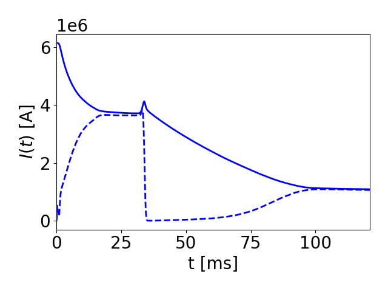

# Integrated Kinetic Runaway Electron Simulation
Highlight by Chris McDevitt (University of Florida) and Xian-Zhu Tang (LANL).

## Overview

The formation and evolution of runaway electrons (RE) is an intrinsically kinetic process. Despite the importance of RE physics to disruption mitigation, the two way coupling of a kinetic description of REs to the bulk plasma evolution remains an outstanding challenge. The code RunAway Monte carlo (RAMc) was developed to prototype the self-consistent description of a drift kinetic RE solver with an evolving bulk plasma, thus enabling an integrated simulation of all phases of a tokamak disruption. This code employs the exascale computing library [Cabana particle simulation toolkit](https://github.com/ECP-copa/Cabana)  along with PETSc based solvers to enable massively parallel simulation.

The use of the drift kinetic formulation employed by RAMc allows for critical elements of RE formation and evolution to be accurately described. Specifically, the solver accurately evaluates the efficiency of RE generation in tokamak geometry across all collisionality regimes [Ref. [1]](https://iopscience.iop.org/article/10.1209/0295-5075/127/45001/meta) and the phase space evolution of a RE population in the presence of large quantities of injected material [Ref. [2]](https://iopscience.iop.org/article/10.1088/1361-6587/aaf4d1/meta). In addition, by incorporating a collisional radiative model FLYCHK, along with the kinetically evaluated RE current density in a flux diffusion equation, the thermal quench, RE plateau, and a variety of rapid current termination schemes can be self-consistently simulated. 

----

## Result

*This integrated solver has recently been employed to describe the phase space evolution of a RE population undergoing a global MHD instability triggered by Deuterium injection. All phases of a tokamak disruption are simulated, beginning with hot tail generation during the thermal quench, the avalanche of the seed RE current, and the formation of a RE plateau. The figure on the left illustrates the current evolution during a simulated disruption, where an MHD instability is triggered by Deuterium injection at t=35 ms resulting in a near complete expulsion of the RE population. While nearly all of the REs are lost, a small remnant seed composed of relativistic trapped electrons is shown to survive the MHD event, and thus allow for a partial reformation of the RE beam via the avalanche mechanism. The second figure indicates the magnitude of the drop of the plasma current that is induced by large scale MHD events as a function of the duration of the instability. It is apparent that only modest drops in the RE current are achieved, even when the flux surfaces remain open for a timescale long compared to the transport timescale associated with the 3D magnetic field.*

----

<video controls preload="metadata" width="100%">
    <source src="../img/gallery/MomDistMovie_2.mp4" type="video/mp4">
    Sorry, your browser doesn't support embedded videos.
</video>

<video controls preload="metadata" width="100%">
    <source src="../img/gallery/PolFluxMovie.mp4" type="video/mp4">
    Sorry, your browser doesn't support embedded videos.
</video>

*The above two movies illustratie the momentum space evolution of the RE population during a global MHD instability along with a sample of RE spatial trajectories. The contours in the latter figure indicate the self-consistently evolved poloidal flux surfaces. With regard to the momentum space evolution, after the initial formation of the RE beam, the triggering of an MHD instability results in the loss of nearly all passing REs, thus leading to a near complete termination of the RE current. However, a small population of relativistic trapped electrons remain confined, thus providing a seed population that allows for the partial reformation of the RE beam once the flux surfaces heal if sufficient poloidal flux is available. From the spatial orbits of the REs, the triggering of an MHD instability leads to the near complete expulsion of the RE population. However, once this RE to Ohmic conversion has been effected, the rapid consumption of poloidal flux leads to a strong inductive electric field driving the partial reformation of the RE beam.*

