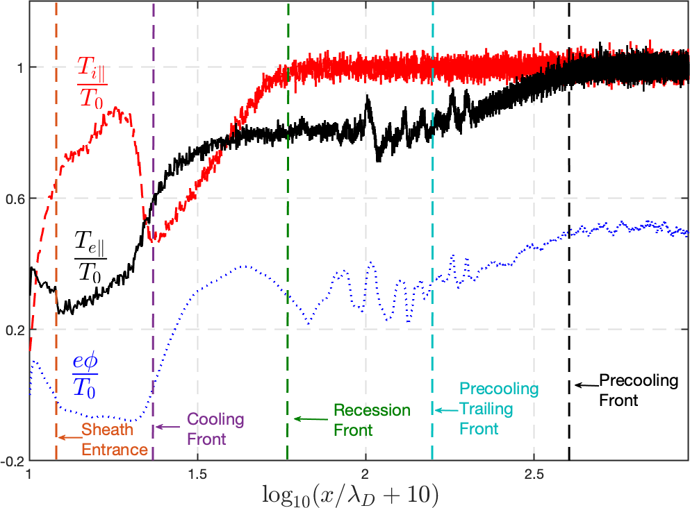
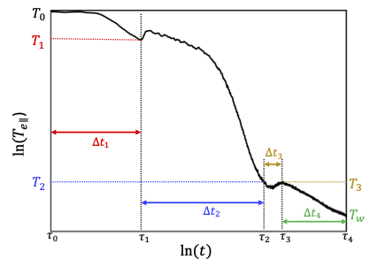
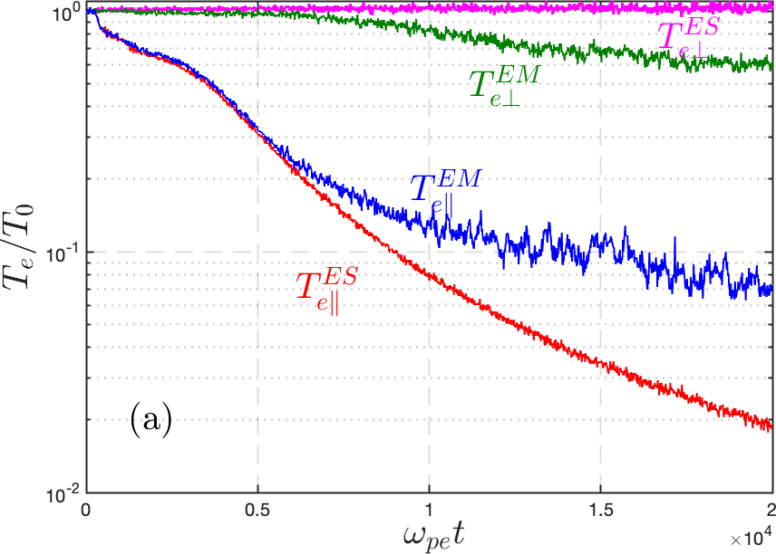

# Parallel transport physics of plasma thermal quench
Highlight by Yanzeng Zhang, Jun Li and Xianzhu Tang Los Alamos National Laboratory (LANL)

**LA-UR-23-23652. Approved for public release; distribution is unlimited.**

## Overview

We use fully kinetic VPIC simulations and analytical theory to elucidate three underlying parallel transport physics that govern the thermal collapse of a fusion-grade and hence nearly collisionless plasma:

1. Thermal collapse of surrounding plasmas due to a localized radiative cooling mass (RCM) is dominated by convective energy transport as opposed to conductive energy transport, and as the result, thermal quench comes in the form of four propagating fronts with distinct
characteristic speeds, all originated from the RCM

2. The overall thermal quench inevitably has a transition from the collisionless phase to the collisional phase. The collisional cooling has its own power scaling with a smaller power -0.4 compared to the collisionless case with a power -2. The transition from collisionless to collisional cooling has its own physics and scaling.

3. The cooling of perpendicular electron temperature closely follows that of parallel
electron temperature, and in a nearly collisionless plasma, is mostly driven by fast electromagnetic (EM) kinetic instabilities.

## Result

*Normalized parallel electron and ion temperature, and
  electrostatic potential from first-principle VPIC simulations. Different right-going fronts are labeled, where a uniform plasma with constant temperature and density is initially fills the whole domain. The cooling spot is implemented as a thermobath (for a radiative cooling spot) at the left boundary, which conserves particles by re-injecting electron-ion pairs (equal to the ions across the boundary) with a much smaller clamped temperature. The right boundary is signified as infinity. 
  Paper: [Cooling flow regime of a plasma thermal quench](https://iopscience.iop.org/article/10.1209/0295-5075/acbb20/meta)*

----

*Schematic view of core parallel electron temperature evolution in log-log scale from VPIC simulations. Preprint: [Staged cooling of a fusion-grade plasma in a tokamak thermal quench](https://arxiv.org/abs/2211.06781)*

----

<video controls preload="metadata" width="100%">
    <source src="../img/gallery/velocity.mp4" type="video/mp4">
    Sorry, your browser doesn't support embedded videos.
</video>
*Plasma parallel velocity. The transition from decompressional cooling to compressional heating is shown when the cooling front (peak of velocity) hits the center. The compressional heating occurs at the transition from collisionless to collisional regime, the latter of which begins when the Landau damping kills the ion sound waves and hence the convection so that the Braginskii conduction dominates.*

----

*The time evolutions of core electron temperature from both electromagnetic (with EM instabilities) and electrostatic (without EM instabilities) simulations with absorbing boundaries for an illustration.*

