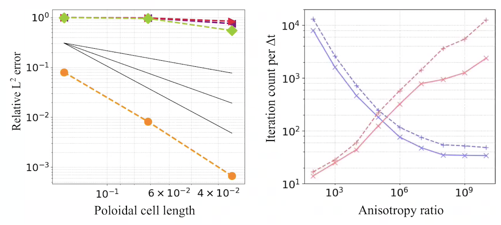
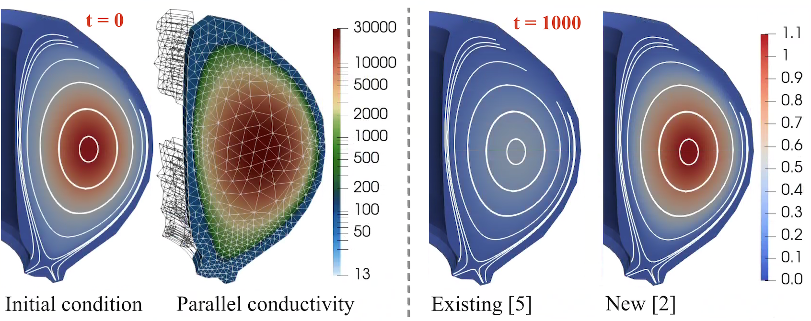
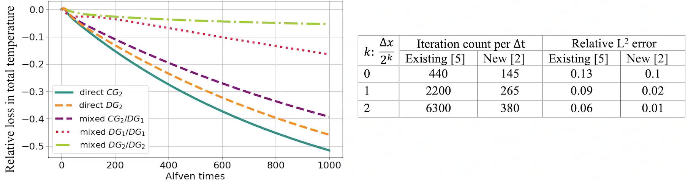

# Anisotropic Transport in PIXIE3D
Highlight by Luis Chacon (LANL)

**LA-UR-22-22433. Approved for public release; distribution is unlimited.** 

## Overview

* Magnetic fusion plasmas feature large heat-transport anisotropy between directions parallel and perpendicular to the magnetic field ($\chi_\parallel/\chi_\perp \sim 10^{10}$).
* Such anisotropies prevent standard MHD discretizations to preserve positivity and to leverage multigrid methods for efficiency (even algebraic MG).
* We have adapted a recently proposed idea [E.J. du Toit et al., Computer Physics Communications 228 (2018)] to transform problematic diffusive cross-fluxes into nonlinear advection operators.
* Approach is amenable to limiting (for positivity preservation) and to multigrid techniques (for solver efficiency).
* Approach can be implemented with high-order accuracy robustly, which is required to simulate large anisotropies accurately (our implementation is a mixed 3rd/4th-order finite-difference representation).

----

## Result

*Poincare plot (left) and poloidal electron temperature (right) field during a (1,1) kink relaxation event in ITER using $\chi_\parallel/\chi_\perp \sim 10^{7}$ with Braginskii transport and Spitzer resistivity. The alignment of the temperature field with the Poincare plot at the plasma core is apparent.*

----

<video controls preload="metadata" width="100%">
    <source src="../img/gallery/bpnch-hall-mhd-unif-rho-chi_par_1e3.mp4" type="video/mp4">
    Sorry, your browser doesn't support embedded videos.
</video>
*Movie of a full reconnection event induced by a (1,1) kink instability of a Bennet pinch equilibrium in helical geometry with $\chi_\parallel/\chi_\perp \sim 10^{7}$.*

# Anisotropic Transport on General Meshes using Finite Elements

Golo Wimmer (LANL), Ben Southworth (LANL), Thomas Gregory (Imperial College London), Xianzhu Tang (LANL)

**LA-UR-23-25763. Approved for public release; distribution is unlimited.**

## Overview

* As an alternative to considering cross-fluxes as above, one can consider the heat flux along magnetic fields as an advection operator. In the context of finite element methods, this has been explored e.g. in [S. Gunter et al., J. Comp. Phys. 226.2 (2007)], with temperature as a continuous Galerkin (CG) finite element field, and parallel heat flux as a discontinous Galerkin (DG) field. Building on this work, we devised an upwind-stabilized mixed DG finite element discretization in [G. Wimmer, B. Southworth, G. Gregory, arXiv:2301.13351 (2023)].
* The mixed DG system of equations can be reordered to better reflect the anisotropic diffusion term as a combination of two advection operators (parallel heat flux as transport of temperature along magnetic field, and transport of parallel heat flux along magnetic field). The two advection operators can then be solved using AIR, an algebraic multigrid method designed for advection problems [T.A. Manteuffel et al., SIAM J. Sci. Comp., 41(5) (2019), T.A. Manteuffel et al., SIAM J. Sci. Comp., 40(6) (2018)]. AIR works well in particular for upwind-stabilized DG advection discretizations, reflecting a discretization design in which accuracy and efficiency are carefully considered in concurrence.
* As a finite element method, the discretization works for arbitrary orders and general tokamak geometries.
* The published work in [G. Wimmer, B. Southworth, G. Gregory, arXiv:2301.13351 (2023)] is restricted to open magnetic field lines. Work on scenarios including closed field lines is currently underway (see tokamak scenario below).

## Result

*Spatial convergence and solver efficiency, for 3D extension of anisotropic heat flux test case of NIMROD MHD code publication [R. Sovinec et al., J. Comp. Phys.195 (2004)]. For the efficiency plot (right), the test case contains closed field lines only (see [G. Wimmer, B. Southworth, G. Gregory, arXiv:2301.13351 (2023)]). In the left convergence plot -- run at anisotropy ratio $10^9$, using non-field aligned prism cells -- orange denotes our new upwind-stabilized mixed DG scheme, green the mixed scheme of [S. Gunter et al., J. Comp. Phys. 226.2 (2007)], and red and purple denote direct CG and DG (using an interior penalty method) discretizations, respectively. In the right plot, purple denotes the new, AIR-based solver strategy, while red denotes a standard solver approach for the mixed scheme of [S. Gunter et al., J. Comp. Phys. 226.2 (2007)] using classical AMG. Solid and dashed lines denote two spatial refinement levels, where solid corresponds to half the resolution of dashed.*

*Anisotropic heat flux equation solved for a temperature/magnetic field configuration corresponding to an MHD equilibrium, using non-dimensionalized quantities and a physically realistic parallel conductivity. When no perpendicular conductivity is used, the solution should be steady state, and any loss in temperature is due to spurious cross diffusion. At 1000 Alfven times, standard finite element methods such [S. Gunter et al., J. Comp. Phys. 226.2 (2007)] suffer a large loss, while the new method of [G. Wimmer, B. Southworth, G. Gregory, arXiv:2301.13351 (2023)] maintains the core temperature well.*

*Additional data for the above anisotropic heat flux equation in a realistic tokamak configuration. The left plot depicts the plasma cooling due to spurious cross diffusion, with [S. Gunter et al., J. Comp. Phys. 226.2 (2007)] in dashed purple, and the new discretization [G. Wimmer, B. Southworth, G. Gregory, arXiv:2301.13351 (2023)] in dotted red for first polynomial order DG finite element space, dash-dotted green for second polynomial order DG space. Standard discretizations lead to a cooling rate of 40% or more, while for the second order new method, it is less than 5%. The right table depicts the number of solver iterations per time step, as well as a relative error, for three different poloidal spatial refinements (the coarsest one depicted above). The new, AIR-based solver retains a low iteration count, while a standard solver approach with classical AMG quickly becomes impractical. In ongoing work, we aim to reduce the iteration count of our new method further.*

