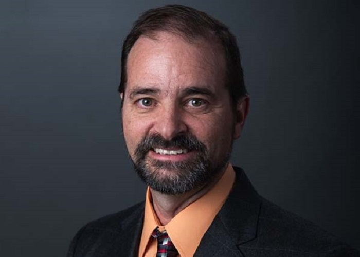
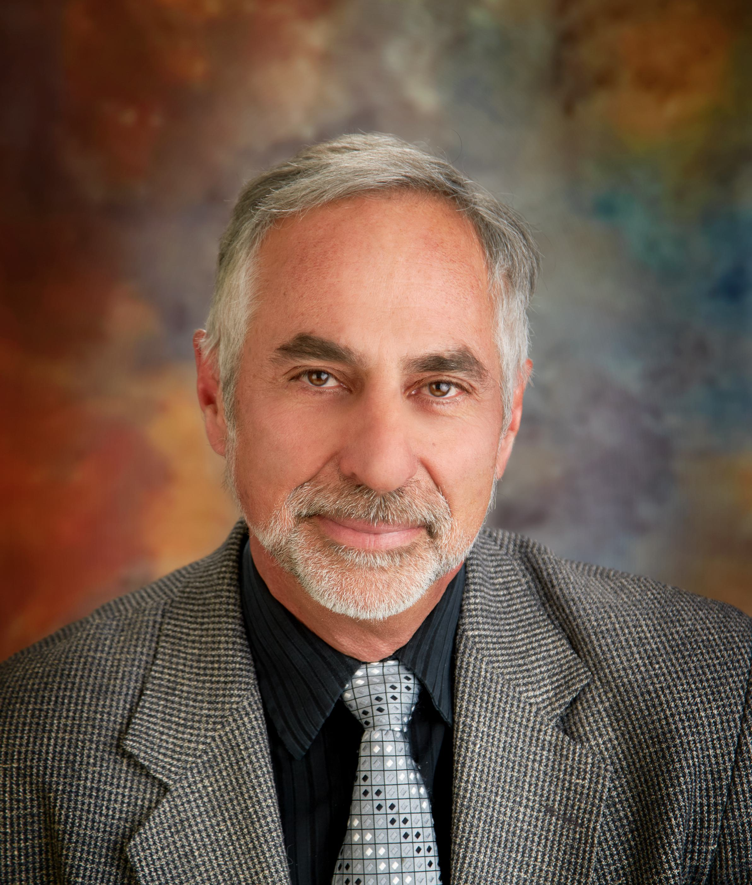

## Awards

    

        
    

    

        <h4 style="margin-bottom: 0"> Luis Chacon receives Enrest Orlando Lawrence Award (DOE)</h4>
        
Jun 21, 2022

        

        The U.S. Department of Energy awarded Luis Chacon (LANL) with Enrest Orlando Lawrence Award for "seminal contributions in multiscale algorithms for fluid, kinetic, and hybrid simulation of plasmas, enabling scientific breakthroughs in fast magnetic reconnection and self-organization in magnetic fusion systems, and in reactivity degradation in inertial fusion systems".        
        

    

    

        
    

    

        <h4 style="margin-bottom: 0"> Luis Chacon was elected fellow of American Physical Society (APS)</h4>
        
Oct 14, 2020

        

        Luis Chacon was nominated by the APS Division of Computational Physics for “seminal contributions in the development of novel algorithms for fluid and kinetic plasma simulation, both Eulerian and Lagrangian, enabling breakthroughs in the understanding of fast magnetic reconnection, and the impact of kinetic effects in strong plasma shocks and in ICF implosions”.
        

    

    

        
    

    

        <h4 style="margin-bottom: 0"> Xueqiao Xu was honored as fellow of American Physical Society (APS)</h4>
        
Oct 14, 2020

        

        Xueqiao Xu was elected by the APS division of Plasma Physics for “wide-ranging contributions to the understanding of the tokamak edge, including edge pedestal stability and the onset and evolution of edge localized modes and for leading the development of edge simulation models and codes".
        

    

    

        
    

    

        <h4 style="margin-bottom: 0"> John N. Shadid was awarded Thomas J.R. Hughes Medal for Computational Fluid Dynamics (USACM)</h4>
        
Jun 28, 2019

        

        The U.S. Assoc. of Computational Mechanics awarded John N. Shadid (SNL) with Thomas J.R. Hughes Medal for Computational Fluid Dynamics for "outstanding and sustained contributions to large-scale parallel multiphysics computational fluid-dynamics solution methods, high-performance computing algorithms/software, and numerical methods for coupled nonlinear partial differential equations”.    
        

    

    

        
    

    

        <h4 style="margin-bottom: 0">  John N. Shadid was elected fellow of Society of Industrial and Applied Math (SIAM)</h4>
        
Jun 9, 2018

        

        The Society of Industrial and Applied Math elected John N. Shadid(SNL) as fellow for "solution methods for multiphysics systems, scalable parallel numerical algorithms, and numerical methods for strongly coupled nonlinear PDEs”.  
        

    

