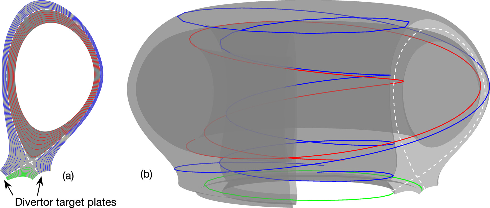
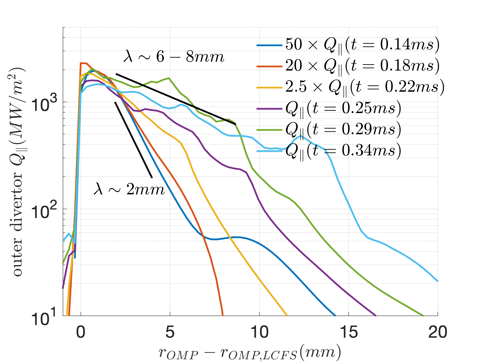
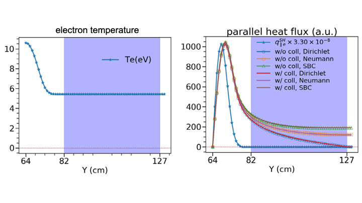

# Thermal Quench of Edge/Boundary Plasmas
Highlight by Xueqiao Xu and Ben Zhu Lawrence Livermore National Laboratory (LLNL)

**LLNL-POST-832817. Approved for public release; distribution is unlimited.**

## Overview

The tasks of BOUT++ for Tokamak Disruption Simulation will capitalize on BOUT++ developments and extend its capabilities to evaluate the physics of particle and energy loads on the divertor plates and wall during a disruption. Highlights here will focus on two development fronts. 

1. Numerical investigations of edge-plasma response to a thermal quench (TQ) (i.e., intensive particle and energy flux flowing from the core region) with the recently upgraded BOUT++ six-field electromagnetic turbulence modeling. 

    In particular, we use the newly added flux-driven option to mimic the TQ outflux into the pedestal in the simulation. As a start, 1 GW heating power, lasting for 80 microseconds is uniformly applied to the pedestal region ($\psi \sim 0.92$) of a typical DIII-D high-confinement (H)-mode plasma that was previously studied for heat-flux width scaling. The total delivered 80 kJ energy is roughly 15% of the stored plasma thermal energy of this DIII-D H-mode discharge. 

1. Further developing gyro-Landau-fluid (GLF) models. 

    Tokamak edge plasma spans a large range of collisionality, from the weakly collisional regime in the pedestal to the highly collisional regime in the divertor. This feature both necessitates the implementation of Landau-fluid (LF) operators in edge-plasma fluid codes, such as BOUT++, and also presents new challenges to existing approaches. While kinetic effects are important, significant spatial inhomogeneities and complicated BCs pose significant difficulties for the standard Fourier implementations of LF operators. Under prior LLNL Laboratory-Directed Research and Development (LDRD) funding, we developed a "fast" configuration-space-based, non-Fourier approach for the application of these operators, which has Fourier-like computational scaling. This approach is based on an approximation of $4/||k||$ by a sum of Lorentzian. The key feature of the approximation is that the Lorentzian can be interpreted as real-space Helmholtz-equation solutions, which can be numerically implemented using highly efficient linear solvers. Both collisionless and collisional LF closure h:q ave been implemented with the existing solvers in BOUT++ by a simple truncation of the infinite sum of Lorentzian. To build on recent advances in artificial intelligence (AI)/machine learning (ML) science, we apply the ML/deep learning (DL) technique to the fluid-closure problem. This ML work significantly extends the recent success of the machine learned Hammett-Perkins closure to a more sophisticated kinetic LF closure and for the first time implements the machine-learned model closures in a fluid simulation code.

## Result

*(a) Flux surfaces in 2D poloidal plane, and (b) magnetic field-lines in the 3D torus. White dashed lines denote separatrix, red, blue and green lines represent magnetic field-lines (b) and their poloidal projections (a) in the closed flux region, scrape-off-layer and private flux region respectively. 
Preprint: [Drift reduced Landau fluid model for magnetized plasma turbulence simulations in BOUT++ framework](https://doi.org/10.1016/j.cpc.2021.108079)*

----

*Evolutions of outboard midplane electron temperature at pedestal top and the maximum heat-flux strikes at the outer divertor plate. Peak heat flux increases significantly as the pedestal top temperature rises in 85 microseconds.*

----

*Outer divertor heat-flux profiles at different time. (1) 50x larger amplitude 40MW/mi^2 to 2GW/m^2 and (2) 3-4x wider width - from 2mm to 6-8mm.*

----

<video controls preload="metadata" width="100%">
    <source src="../img/gallery/144981_pt1_t200-930.mp4" type="video/mp4">
    Sorry, your browser doesn't support embedded videos.
</video>
*Pressure perturbation increases ~5x and spreads from near separatrix to the entire domain. (left) the total pressure; (right) normalized pressure.*

----

<video controls preload="metadata" width="100%">
    <source src="../img/gallery/Qpar_odt.mp4" type="video/mp4">
    Sorry, your browser doesn't support embedded videos.
</video>
*TQ simulations with and w/o mitigation (MGI). MGI stands for Massive Gas Injection. Simulations suggest that MGI could reduce the peak heat load on divertor target and spreads it over a wider wetting area.*

----

*(left) The temperature profile with constant tail for presenting nonlocal effects and testing different boundary conditions, and (right) Parallel heat flux calculated from collisional ("w/coll") and collisionless ("w/o coll") Landau-fluid (LF) closure with different boundary conditions: Dirichlet, Neumann, and Sheath boundary condition (SBC). $q_\parallel^{SH}$ is the parallel heat flux calculated from classical Spitzer–Härm expression. The two extra cells on the right side of the blue span are the ghost cells where the boundary conditions are applied.
Preprint: [Extension of Landau-fluid closure to weakly collisional plasma regime](https://doi.org/10.1016/j.cpc.2018.10.024)*

----

*Mean-absolute-error versus the number of training samples. Dashed and solid lines denote training and testing error respectively; red, blue, and green lines represent MLP with ReLU (rectified linear unit), MLP with tanh, and CNN with ReLU as the combinations of network and activation function, respectively. The yellow line represents Discrete Fourier Transform results, while the purple line represents the result of an optimized Bayesian model. 
Preprint: [Machine learning surrogate models for Landau fluid closure](https://doi.org/10.1063/1.5129158)*

