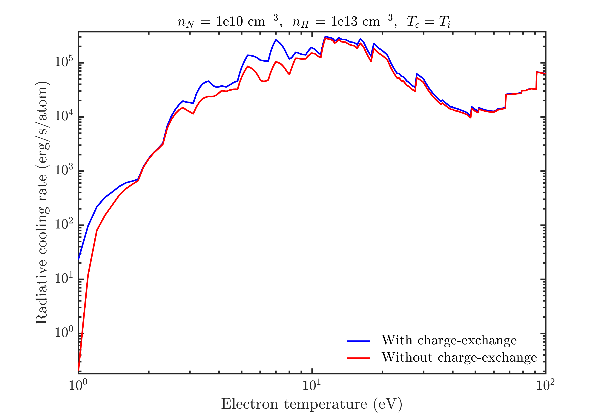

# Collisional-Radiative Modeling
Highlight by Nathan A. Garland (Griffith University, Australia), Prashant Sharma(LANL), Hyun-Kyung Chung (Korea Institute of Fusion Energy), Christopher J Fontes (LANL), Mark C Zammit (LANL), James Colgan (LANL), Todd Elder (Columbia), Christopher J McDevitt (University of Florida), Timothy M. Wildey (SNL), Xian-Zhu Tang (LANL)

## Overview

Many collisional-radiative (CR) modeling approaches well describe thermal plasmas found in tokamaks. The presence of runaway electrons can violate many assumptions inherent in most CR models commonly used in plasma modelling. In this collaboration we explore and benchmark accurate electron collision data, and apply it to CR modelling of tokamak plasmas doped with relevant impurity atoms. Our work demonstrates a crucial influence of even minority runaway electron populations at low thermal plasma temperatures, typical of post-thermal quench tokamak discharges.

----

## Result

*At relativistic energies, typical of runaway electrons generated in tokamak disruption scenarios, inelastic scattering cross-sections for electrons impacting high-Z impurities increases. This departure from the often assumed $\log(E)/E$ roll-off with increasing $E$, where $E$ is the electron impact energy, is a relativistic correction obtained through an appropriate quantum electrodynamics (QED) treatment of the scattering event. Including such inelastic cross-sections in a collisional-radiative model with representative runaway electron energy distributions, allows one to see increased charge state populations, and thus radiative potential, of a discharge at low thermal electron temperatures.  In these regimes runaway ionization plays a dominant role among collisional-radiative pathways of an expected ITER-like mitigated post-disruption tokamak discharge.*

<video controls preload="metadata" width="100%">
    <source src="../img/gallery/cr_runaway_movie.mp4" type="video/mp4">
    Sorry, your browser doesn't support embedded videos.
</video>
*This animation demonstrates charge state distribution spread of neon ions in a ITER-like plasma with a 10 MeV peaked runaway population capable of carrying an ITER-like current post-thermal quench. As thermal temperature $T_e$ decreases, the influence of runaway driven inelastic collisions increases, and a higher average charge state is produced, along with a greater spread of charge states.*

----

## Inclusion of charge-exchange dynamics in a collisional-radiative model for magnetic fusion plasmas

This collisional radiative simulation use [[N + H] Plasma parameters: $n_N = 10^{10} cm^{-3},\, n_H = 10^{13} cm^{-3},\, T_i = T_e$]

### Charge-state fraction v/s electron temperature

*The variation of charge-state fraction of nitogen ions in nitrogen-hydrogen palsma with and without charge-exchange process. It is observed that the inclusion of charge-exchange process in the calculations, shifts the charge states to higher electron temperatures. This effect is quite significant for $N^{1+}$ to $N^{4+}$ ions. For neutrals and higher charge states ($N^{5+}$ - $N^{7+}$) this effect is less significant.*

### Average charge-state v/s electron temperature

*The variation of average charge-state of nitrogen ions in nitrogen-hydrogen plasma with and without charge-exchange process. The maximum contribution of charge-exchange is in the range of 3-10 eV, where the inclusion of charge-exchange reduces the effective charge-state of the plasma. At lower and higher electron temperatures, this effect is not so significant due to the low charge-exchange cross-section and less neutral atomic density, respectively.*

### Radiative cooling rate v/s electron temperature

*The variation of radiative cooling rate of nitrogen ions in nitrogen-hydrogen plasma with and without charge-exchange process. Due to the addition of another radiative channel, i.e., charge-exchange process, we see a substantial increase in the radiative cooling rate in the electron temperature range of 3-10 eV. For higher temperature range, this difference is not so significant.*

