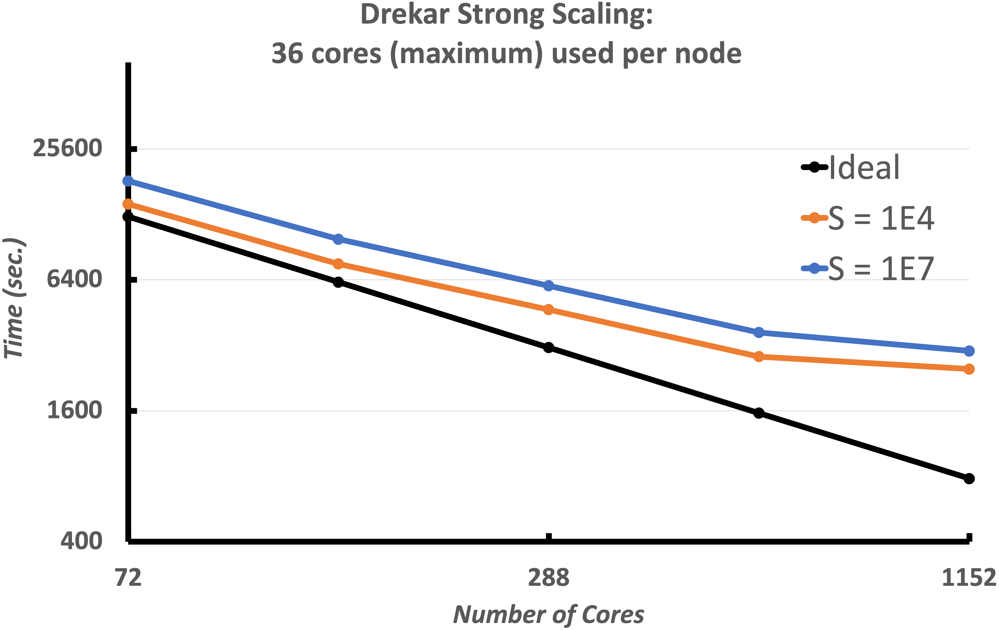
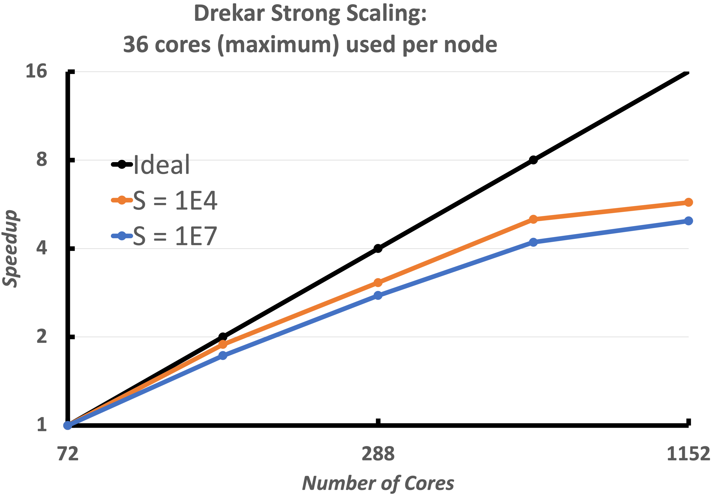
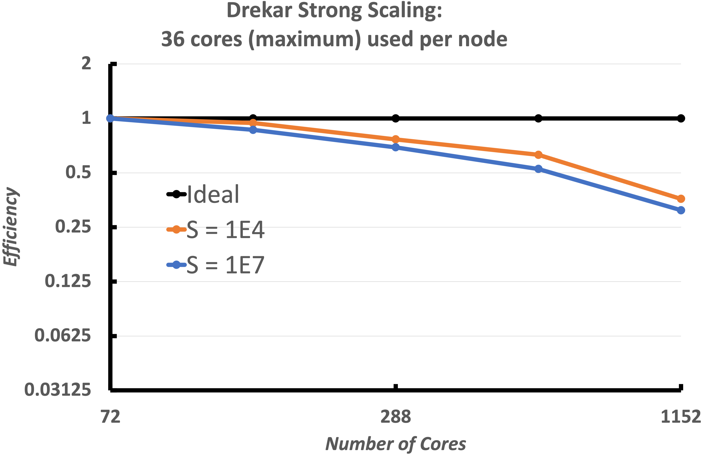
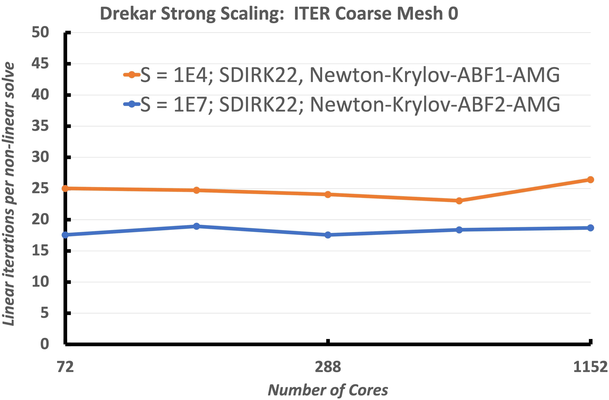
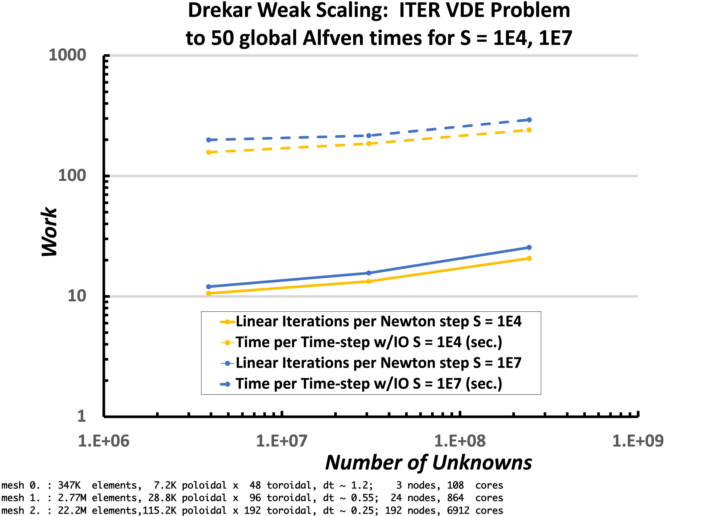
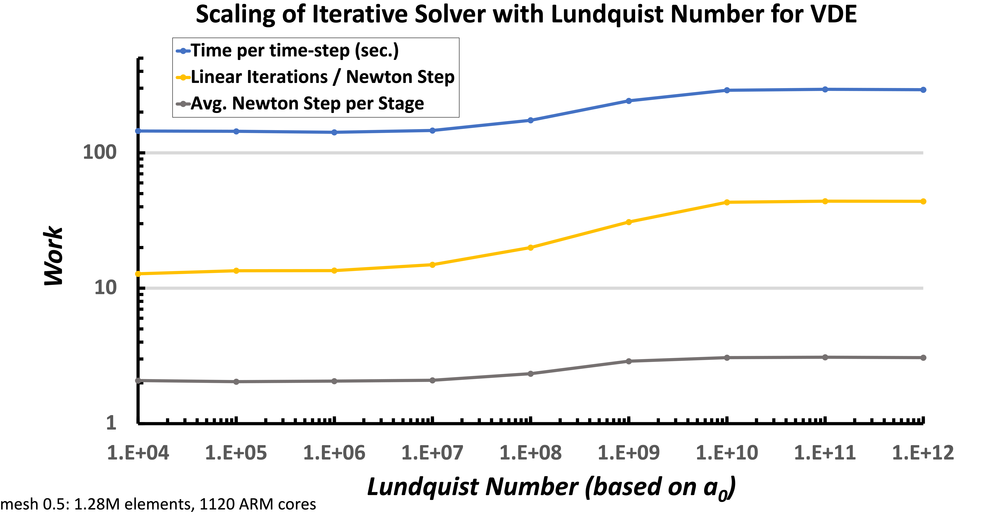

# High performance parallel scaling of fluid plasma simulations in Drekar

Sandia National Laboratories + collaborators (LANL, FASTMATH)

**SAND2022-3490 W. Approved for public release; distribution is unlimited.** 

## Overview

Disruption modeling for characterization, prediction, and mitigation is essential for realizing tokamak
fusion. In TDS, advanced plasma models (extended MHD, & multifluid) are being explored for modeling
electron dynamics, fast reconnection, transport in 3D fields, and strong neutral jet - plasma interactions.
To enable TDS studies, we are applying and extending advanced ASCR scalable algorithms and software
for 

1. Implicit/IMEX extended MHD and multifluid EM plasma formulations with stabilized unstructured FE discretizations as continuum models,

1. Iterative solvers, and optimal physics-based multigrid preconditioners for efficient solution of multiple-time-scale plasma physics systems,

----

## Scaling of Multilevel Preconditioners for resistive MHD based on multiphysics block preconditioning (preliminary results)

Jesus Bonilla (LANL), Michael Crockatt (SNL), Jonathan Hu (SNL), Peter Ohm (SNL), Edward Phillips (SNL), John Shadid (SNL), Xian-Zhu Tang (LANL), Ray Tuminaro (SNL)

A critical component of implicit or IMEX MHD simulations of complex multiphysics systems is the development of scalable preconditioners.
In this context there are two significant issues that must be addressed for implicit solution of these systems.
These are the ill-conditioning of the linear systems that occurs due to the existence of elliptic type operators related to
diffusion type process, and hyperbolic type operators that are often generated from off-diagonal cross-coupled transport mechanisms.
To handle the elliptic type ill-conditioning optimal scalable multilevel methods are employed. For the
cross-coupled multiphysics hyperbolic interactions physics-based (PB) / approximate block preconditioning (ABF) preconditioning approaches
are used. These PB/ABF methods reduce the implicit solve for the complex coupled multifluid system into
a set of sub-systems that segregate the physics (in the preconditioner only) for which we have demonstrated
the use of scalable algebraic multilevel solvers. General details of these approaches can be found in [VMS Incompressible MHD](https://doi.org/10.1016/j.cma.2016.01.019), [Fully-coupled AMG Resistive MHD](https://doi.org/10.1016/j.cam.2017.09.028), [ABF 2D Reduced MHD](https://doi.org/10.1137/12088879X), [Teko PB/ABF Preconditioning Package](https://doi.org/10.1137/15M1017946).

### Strong scaling of fully implicit VMS resistive MHD formulation 

We now consider a heterogeneous geometry consisting of the plasma region ITER geometry as well as the surrounding solid wall. These figures demonstrate the strong scaling of the implementation for two Lundquist numbers $10^4$, $10^7$.
The simulations use a mesh with 346, 272 elements (7.2K poloidal 48 toroidal) and run to 100 global Alfven times with a constant time-step size dt = 2. This results in a max Alfven wave $CFL_A=750$ and max flow $CFL_u ={3}/{2}$. The number of cores is increased from 72 cores to 4680 cores, a 16x increase. The tests start with around 4800 elements per core with 72 cores, and end with around 300 elements per core with 1152 cores. The strong scaling begins to to become less efficient after approx. 300 elements per core done on 1152 cores. This is to be expected with so little work per core and with increasing cost for communication. The total time to solution, the speedup, efficiency and the iteration count for the solver are all presented. This scaling is excellent for a fully-implicit resistive MHD formulation with 300 elements per processor at the 1152 core case. The linear solver iteration results also demonstrate that the V-cycle coarse grid projection operators and coarse smoothers, and coarse grid solver are working as required as the processor count / sub-domains are increasing. It should be noted that a slightly more expensive smoother was used for the $S=10^7$ case.

    

        
    

    

        
    

    

        
    

    

        
    

*Strong scaling of the VMS unstructured FE low Mach number compressible MHD solver (Drekar) for two Lundquist numbers, $S = 10^4,\ 10^7$. The results show excellent strong scaling and demonstrate that up to as few as 300 elements per processor the fully-implicit formulation scales well for this cold VDE simulation.*

### Weak scaling of fully implicit VMS resistive MHD formulation 

Next we have weak scaling plotted in this figure. The weak-scaling tests were done with both a Lundquist number $S = 10^4$  and $S = 10^7$. The time-step size was limited by both a max Alfven wave $CFL_A = 400$ and a max flow $CFL_u = 2.0$ resulting in approximate average time-step sizes of 1.2, 0.55, and 0.25 global Alfven times for the respective mesh sizes. The simulation was run to 50 global Alfven times. The smallest mesh contained 346,272 elements (7.2K poloidal 48 toroidal), with 3,876,048 unknowns and was run on 108 cores. The next mesh contained 2,770,176 elements (28.8K poloidal 96 toroidal), with 30,739,104 unknowns and was run on 864 cores. The largest mesh contained 22,161,408 elements (115.2K poloidal 192 toroidal), with 244,842,048 unknowns and was run on 6912 cores. This weak Scaling shows that the very good scaling of the approximate block multiphysics preconditioner and Schur complement approximations Are capturing the required unresolved fast physics.

    

    

        
    

    

*Weak scaling of the VMS unstructured FE low Mach number compressible MHD solver (Drekar) for two Lundquist numbers, $S = 10^4,\ 10^7$. The results show excellent week scaling and demonstrate that up to 6912 processors the fully-implicit formulation scales well for this cold VDE simulation.*

### Lundquist number scaling of fully implicit VMS resistive MHD formulation 

Finally, the scaling of the iterative solver with respect to the Lundquist number is shown. The time-step size was limited by a max Alfven wave $CFL_A = 400$ and a max flow $CFF_u= 2$, and was run to 25 global Alfven times, resulting in an average time-step size of $dt =1.2$. The mesh has 346,272 elements, and was run on 896 ARM cores. These results indicates that the fully-implicit formulation and approximate block preconditioners are robust with respect to increasing Lundquist numbers over this large $10^8$ increase.

    

        
    

    

*Lundquist number scaling of the VMS unstructured FE low Mach number compressible MHD solver (Drekar) for a fixed mesh size. The results show excellent scaling and demonstrate that up to $S=10^{12}$.*

----

## Scalable multilfuid EM solvers based on multiphysics block preconditioning
John Shadid (SNL), Edward Phillips (SNL)

A critical component of simulating large-scale multifluid systems is our
physics-based (PB) / approximate block preconditioning (ABF) preconditioning approaches for complex
multiphysics, these methods reduce the implicit solve for the complex coupled multifluid system into
a set of sub-systems that segregate the physics (in the preconditioner only) for which we have demonstrated
the use of scalable algebraic multilevel solvers. As a demonstration of the scalability of our multifluid
simulation capabilities we present an example weak scaling study. This example is for a fully-ionized
ion/electron high density/pressure core expanding into a magnetized background ion/electron
plasma and the simulations were run on the LANL Trinity machine on > 16,000 cores.

*Illustration of weak scaling for implicit fully-ionized multifluid plasma model (electrons, ions) for the simulation of an 3D high density/pressure
cloud expanding in a lower density background plasma with anisotropic expansion due to the presence of a magnetic field. Multiphysics block preconditioning
methods are used to provide a scalable solution in parallel on the Los Alamos Trinity machine.*

The physics simulation goal is to understand impurity penetration and assimilation into plasmas for proposed disruption
mitigation techniques. These techniques currently include massive gas injection and frozen pellet injection.
To computationally simulate the proposed type of problems requires robust, accurate and
scalable plasma modeling capabilities. We have completed an initial development of a general
capability for partially-ionized plasmas composed of multiple atomic species with strongly driven multidimensional
hydrodynamic transport processes, collisional, ionization and recombination interactions,
and strong coupling to electric and magnetic fields.

\bibliography

