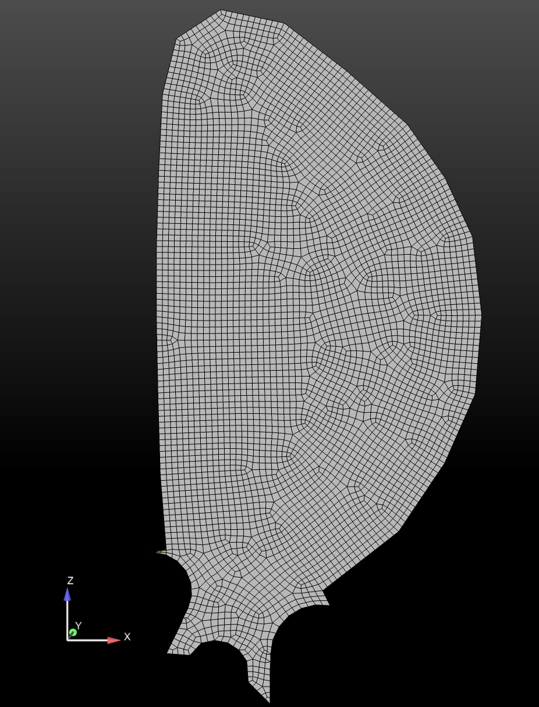
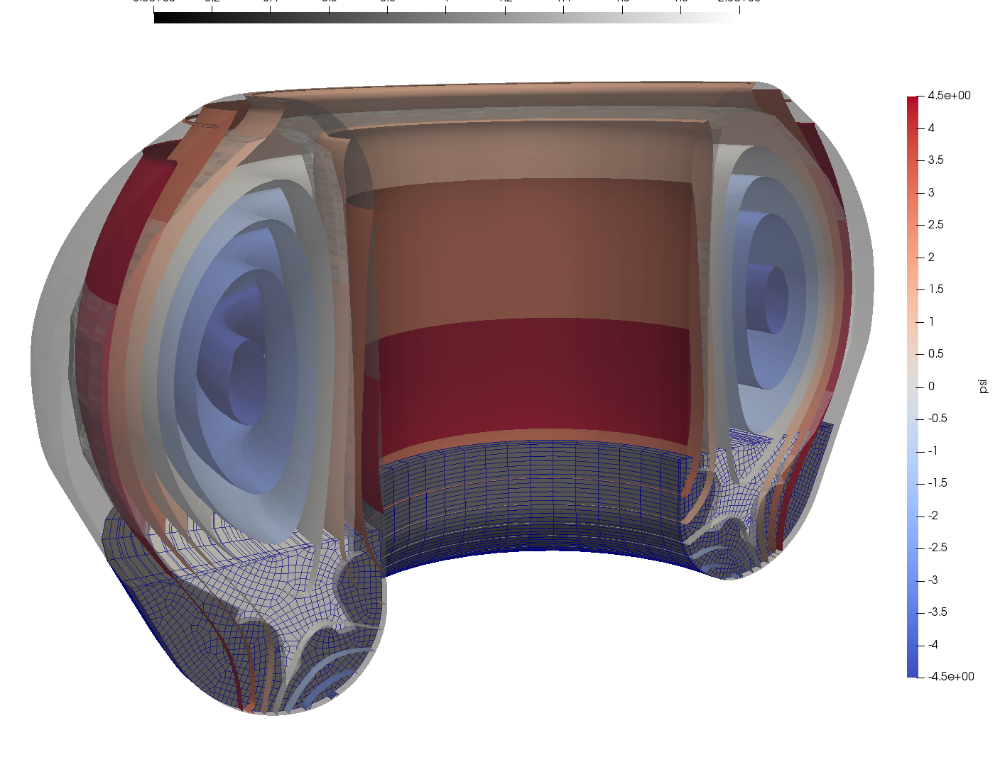

# Development of Efficient IMEX Unstructured FE Multiphysics MHD Plasma Simulation Capabilities

Sandia National Laboratories + collaborators (LANL, FASTMATH, others)

**SAND2022-3490 W. LA-UR-23-25947. Approved for public release; distribution is unlimited.** 

## Overview

Disruption modeling for characterization, prediction, and mitigation is essential for realizing tokamak
fusion. In TDS, advanced plasma models (extended MHD, & multifluid) are being explored for modeling
electron dynamics, fast reconnection, transport in 3D fields, and strong neutral jet - plasma interactions.
To enable TDS studies, we are applying and extending advanced ASCR scalable algorithms and software
for 

1. Implicit/IMEX extended MHD plasma formulations with stabilized unstructured FE discretizations as continuum models,

1. Iterative solvers, and optimal physics-based multigrid preconditioners for efficient solution of multiple-time-scale plasma physics systems,

----

## Highlight on Variational Multiscale (VMS) FE Resistive MHD Formulation and solution of Vertical Displacement Events (VDE) in ITER (preliminary results)

Jesus Bonilla (LANL), John Shadid (SNL), Xianzhu Tang (LANL), Michael Crockatt (SNL), Roger Pawlowski (SNL), Sidafa Conde (SNL)

Visco-resistive compressible MHD simulation of a Vertical Displacement Event (VDE) during a disruption. A variational multiscale (VMS) stabilized FE method with highly scalable multilevel block-preconditioning techniques have been used to perform the simulation in ITER geometry (3D). An initial mesh of about 125K elements and one million unknowns have been
used for an initial study. The VDE simulation is started with MHD
equilibrium obtained from a Grad-Shafranov solver using real case ITER configuration. An artificial cooling term has been added to model the temperature quench in 
a disruption. The solver is able to cope with very large velocities triggered by the sudden loss of temperature, as well as the density perturbations. 
An initial assessment of wall forces and temperatures can be done from the computed wall currents. The simulation solves for (1) the compressible flow (momentum, density, internal energy)
and for magnetics (magnetic fields and a Lagrange multiplier to enforce the solenoidal involution). Details of aspects of the VMS formulation can be found in [VMS Incompressible MHD](https://doi.org/10.1016/j.cma.2016.01.019), [VMS Incompressible FE turbulence model MHD](https://doi.org/10.1016/j.jcp.2015.04.035).

    

    

       
    

    

*Unstructured FE hex mesh of ITER plasma domain and solid wall using Cubit. Cubit provides both all hexahedron and tetrahedron capabilities. Capabilities for automatic uniform refinement and parallel portioning are available. As well soon a uniform refinement that snaps the element edges to the geometry will also be available.*

    

    

*Visualization of the unstructured FE mesh of poloidal cross-section using Cubit. A multiple iso-surface plot of Psi initial condition in the 3D mesh with the solid 1st wall.*

<video controls preload="metadata" width="100%">
    <source src="../img/gallery/drekar/VDE_movie.mp4" type="video/mp4">
    Sorry, your browser doesn't support embedded videos.
</video>
*An initial VDE simulation on 3D ITER geometry usign a VMS compressible resistive MHD formulation in Drekar.*

<video controls preload="metadata" width="100%" poster="../img/gallery/drekar/modes_image.jpg">
    <source src="../img/gallery/drekar/modes.mp4" type="video/mp4">
    Sorry, your browser doesn't support embedded videos.
</video>
*Pressure isosurface of 1,1-mode and 2,2-mode of an initial 1,1-kink mode simulation*

<video controls preload="metadata" width="100%">
    <source src="../img/gallery/drekar/poincarePlot.mp4" type="video/mp4">
    Sorry, your browser doesn't support embedded videos.
</video>

Poincare plot of an initial 1,1-kink mode simulation leading to a major disruption

\bibliography

