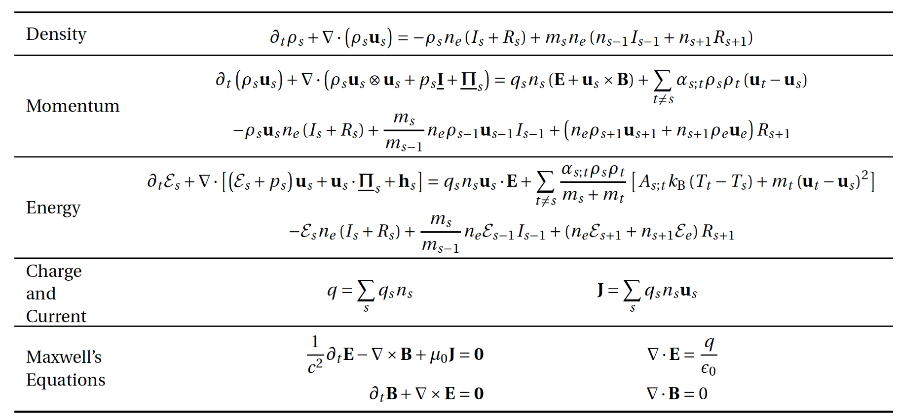
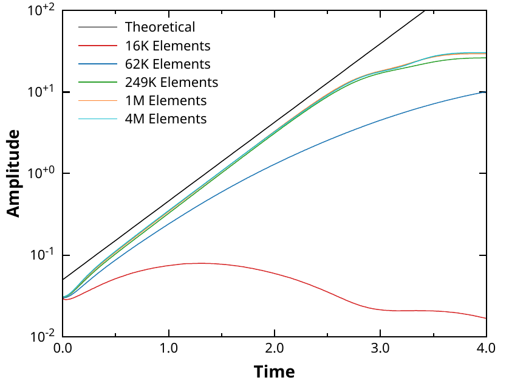
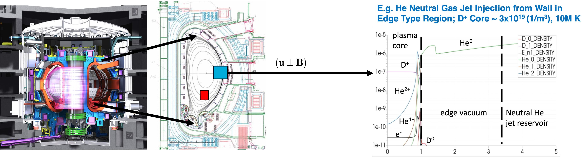
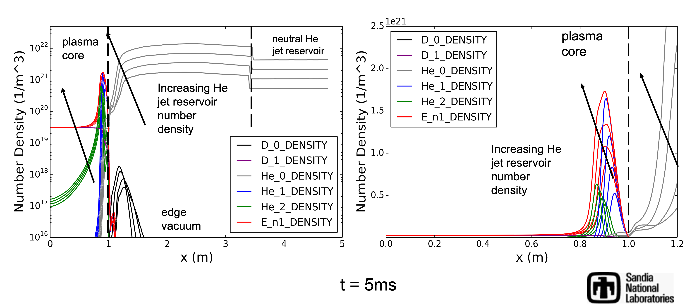

# Development of Efficient IMEX Unstructured FE Multiphysics Multifluid Plasma Simulation Capabilities

Sandia National Laboratories + collaborators (LANL, FASTMATH, others)

**SAND2022-3490 W. Approved for public release; distribution is unlimited.** 

## Overview

Disruption modeling for characterization, prediction, and mitigation is essential for realizing tokamak
fusion. In TDS, advanced plasma models (extended MHD, & multifluid) are being explored for modeling
electron dynamics, fast reconnection, transport in 3D fields, and strong neutral jet - plasma interactions.
To enable TDS studies, we are applying and extending advanced ASCR scalable algorithms and software
for 

1. Implicit/IMEX multifluid EM plasma formulations with stabilized unstructured FE discretizations as continuum models,

1. Iterative solvers, and optimal physics-based multigrid preconditioners for efficient solution of multiple-time-scale plasma physics systems,

----

## Highlight on multifluid EM plasma simulations for disruption mitigation techniques (preliminary results)
Michael Crockatt(SNL), John Shadid(SNL), Roger Pawlowski(SNL), Sidafa Conde (SNL), Tom Smith (SNL), Sibu Mabuza (Clemson) 

For the TDS effort Sandia is extending and evaluating a multifluid electromagnetic (EM) plasma model
for simulating collisional partially ionized plasma systems with hydrodynamic and EM interactions that
can be strongly driven and create discontinuities and strong gradients. The model is based on a five
moment multifluid model. A specific capability goal is a flexible and extensible capability for modeling
complex multiphysics plasmas in the context of proposed tokamak disruption mitigation strategies.
The most general multifluid electromagnetic plasma model considered in this project is presented below.
This system has a hyperbolic transport/wave physics system sub-structure (Euler-Maxwell) with
strong EM, collisional, and ionization/recombination source term coupling, along with the inclusion of
2nd order diffusion type operators (most notably heat transfer). To make this ambitious approach to
employing scalable multifluid EM plasma models tractable for TDS, we are building on recent unique
algorithmic, and plasma-model developments by our team in the Drekar R&D MHD and multi-fluid/EM
code as a software-base. The overall structure of this model is given below.

*Five moment general multifluid model for atomic species s with collisional, ionization and recombination
terms included and coupled to a full electromagnetic Maxwell system. This model is implemented within the
**Drekar** multiphysics code. **Drekar** is an implicit/explicit (IMEX) scalable parallel unstructured FE code
that employs algebraic flux corrected stabilization methods for handling unresolved gradients and strong shock discontinuities. 

----

## An illustration of a Two-dimensional diocotron instability – Analytic growth rate comparison
Michael Crockatt(SNL), John Shadid(SNL)

Diocotron instabilities [@ronald2001][@knauer1966][@petri2007], which are driven by velocity shear in non-neutral electron columns, have been
studied experimentally and computationally in beam and cylindrical geometries. We
consider a configuration consisting of a cylindrical electron beam inside a uniform axial magnetic field. In
this case, a rotational velocity is produced in the plasma column due to $E\times B$ forces exerted on the electron
fluid. A suficiently strong shear in this rotational velocity drives the development of the cylindrical diocotron
instability. Because the development of the instability is dominated by $E\times B$ forces, the electric drift
approximation is often used to reduce the electron velocity equation to that of a guiding center model, which
removes the cyclotron motion of the particles.

<video controls preload="metadata" width="100%">
    <source src="../img/gallery/drekar/diocotron-instability-2d_5_1e-3_elliptic-potential_000512_presentation.mp4" type="video/mp4">
    Sorry, your browser doesn't support embedded videos.
</video>
*The movie shows the computed solution on a triagnular FE mesh for the case for the linear growth and saturation of the
Instability. The two figures show the computed growth of the most unstable mode for both a full multifluid comptuation
And a generalized Ohm’s law formulation in Drekar.*

    
    <em>Multifluid growth rate vs mesh resolution</em>

    
    <em>Generalized Ohm's law without electron inertia</em>

----

## Neutral cloud expansion in a core region
Here we first present an idealization of the process of introducing a
high-density neutral species into the core region of a Deuterium plasma at conditions that are representative of
Tokamak devices. In this case a 1D simulation is present and the transport is taken to be parallel to the magnetic field direction.

*Schematic diagram of an idealized insertion of a neutral cloud in the core region for disruption mitigation. Inside the separatrix a
high density neutral cloud of Ar ionizes as it expands into a hot (10keV) Deuterium plasma environment.*

*Comparison of expansion of (He, Ne, Ar) neutral cloud in the core region for disruption mitigation at 2.5 micro-seconds. Inside the separatrix the
high density neutral cloud ionizes as it expands into a hot (10keV) Deuterium plasma environment. The simulation tracks up to 10 species Deuterium neutral and ion, electrons
and the neutral and up to 6 charge states of the inserted species.*

## Massive gas injection
Next, we present an idealization of the process of injecting a high-density neutral species from the Tokamak wall into the core region.
The jet first expands in the fill tube region, the propagates through a low-density edge/vacuum region, then impacts a static Deuterium plasma core at conditions that are
representative of Tokamak devices. In this case a 1D simulation is present and the transport is taken to be perpendicular to the magnetic field direction.

*Schematic diagram of an idealized massive gas injection of a He neutral into the core region for disruption mitigation. The
jet expands through the edge/vacuum region and impacts a static Deuterium core.*

<video controls preload="metadata" width="100%">
    <source src="../img/gallery/drekar/He_3e21_neutral_D_plasma_highorder_ndlimiter_1e15_cfl_20_2.mp4" type="video/mp4">
    Sorry, your browser doesn't support embedded videos.
</video>
*Illustration of a 2D jet of high-density neutral Helium injected from a reservoir at n = $3\cdot 10^{21}\, m^{-3}$ expanding into the edge/vacuum region and impacting a static Deuterium plasma core.
Here a strong breaking assumption is used on the charge species due to an imposed strong static magnetic field perpendicular to the jet injection direction.
The simulation time is 5 ms and plots the linear (upper left) and logarithmic (lower left) mass density for all the species [kg/m^3],
the electron temperature [K] (lower right), and the electron mass density [kg/m^3] (upper right). The problem set up is similar to E. Nardon et. al. (2017
Nucl. Fusion 57 016027) for the injection of D2.*

*Summary of preliminary results for He neutral jet injection from Tokamak wall at 5ms. The results are for increasing levels of
He jet number density, 3.0e+21, 6.0e+21, 1.2e+22, 2.4e+22 [1/m^3]. These levels correspond to
~100x, 200x, 400x, 800x the initial D+ nuclei content of the core plasma. Here the number density [1/m^3] is plotted. The problem set up is similar to E. Nardon et. al. (2017
Nucl. Fusion 57 016027) for the injection of D2. Left full domain, right close-up of core region.*

\bibliography

