# Development of Efficient IMEX Unstructured FE Multiphysics Plasma Simulation Capabilities

Sandia National Laboratories + collaborators (LANL, FASTMATH, UMD, others)

**SAND2022-3490 W. Approved for public release; distribution is unlimited.** 

## Overview

Disruption modeling for characterization, prediction, and mitigation is essential for realizing tokamak
fusion. In TDS, advanced plasma models (extended MHD, & multifluid) are being explored for modeling
electron dynamics, fast reconnection, transport in 3D fields, and strong neutral jet - plasma interactions.
To enable TDS studies, we are applying and extending advanced ASCR scalable algorithms and software
for 

1. Implicit/IMEX extended MHD and multifluid EM plasma formulations with stabilized unstructured FE discretizations as continuum models,

1. Iterative solvers, and optimal physics-based multigrid preconditioners for efficient solution of multiple-time-scale plasma physics systems,

1. Uncertainty quantification for high-dimensional spaces using reduced sampling (multilevel
Monte Carlo) and multifidelity approaches.

----

## Highlight on Variational Multiscale (VMS) FE Resistive MHD Formulation and solution of Vertical Displacement Events (VDE) in ITER (preliminary results)

Jesus Bonilla (LANL), John Shadid (SNL), Xianzhu Tang (LANL), Michael Crockatt (SNL), Roger Pawlowski (SNL), Sidafa Conde (SNL)

Visco-resistive compressible MHD simulation of a Vertical Displacement Event (VDE) during a disruption. A variational multiscale (VMS) stabilized FE method with highly scalable multilevel block-preconditioning techniques have been used to perform the simulation in ITER geometry (3D). An initial mesh of about 125K elements and one million unknowns have been
used for an initial study. The VDE simulation is started with MHD
equilibrium obtained from a Grad-Shafranov solver using real case ITER configuration. An artificial cooling term has been added to model the temperature quench in 
a disruption. The solver is able to cope with very large velocities triggered by the sudden loss of temperature, as well as the density perturbations. 
An initial assessment of wall forces and temperatures can be done from the computed wall currents. The simulation solves for (1) the compressible flow (momentum, density, internal energy)
and for magnetics (magnetic fields and a Lagrange multiplier to enforce the solenoidal involution). Details of aspects of the VMS formulation can be found in [VMS Incompressible MHD](https://doi.org/10.1016/j.cma.2016.01.019), [VMS Incompressible FE turbulence model MHD](https://doi.org/10.1016/j.jcp.2015.04.035).

    

    

       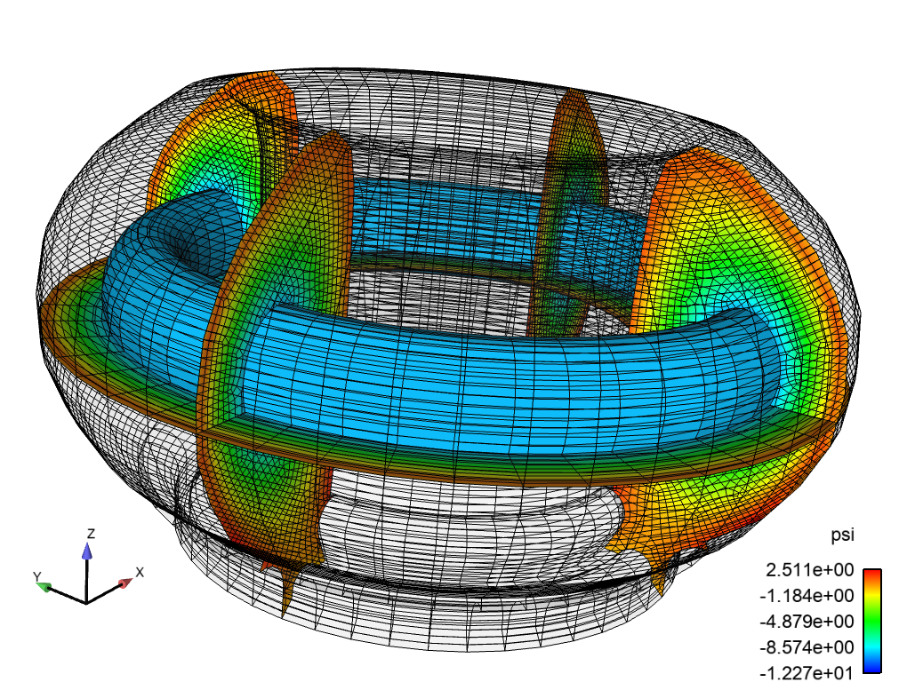
    

    

*Unstructured FE hex mesh of ITER plasma domain and solid wall using Cubit. Cubit provides both all hexahedron and tetrahedron capabilities. Capabilities for automatic uniform refinement and parallel portioning are available. As well soon a uniform refinement that snaps the element edges to the geometry will also be available.*

    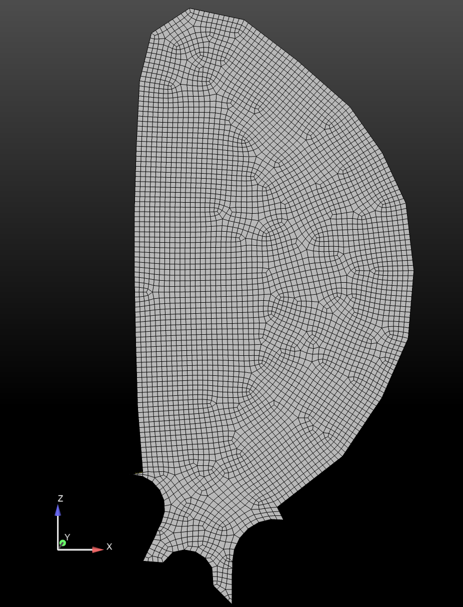

    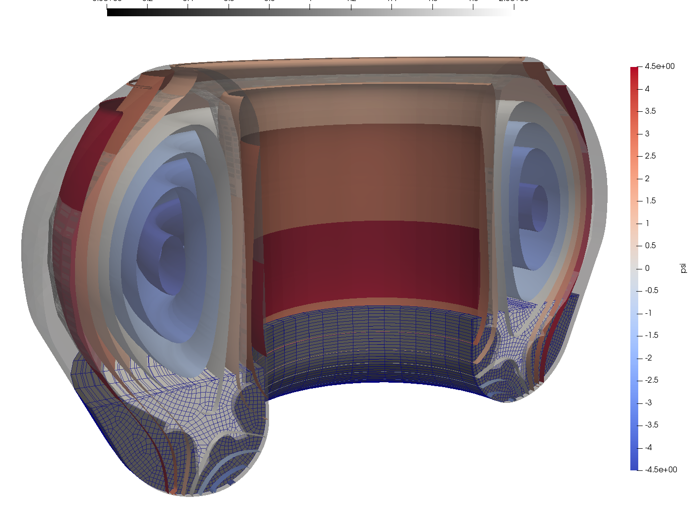

*Visualization of the unstructured FE mesh of poloidal cross-section using Cubit. A multiple iso-surface plot of Psi initial condition in the 3D mesh with the solid 1st wall.*

<video controls preload="metadata" width="100%">
    <source src="../img/gallery/drekar/VDE_movie.mp4" type="video/mp4">
    Sorry, your browser doesn't support embedded videos.
</video>
*An initial VDE simulation on 3D ITER geometry usign a VMS compressible resistive MHD formulation in Drekar.*

----

## Scaling of Multilevel Preconditioners for resistive MHD based on multiphysics block preconditioning (preliminary results)

Peter Ohm (SNL), John Shadid (SNL), Edward Phillips (SNL), Ray Tuminaro (SNL),Jonathan Hu (SNL), Jesus Bonilla (LANL), Michael Crockatt (SNL) 

A critical component of implicit or IMEX MHD simulations of complex multiphysics systems is the development of scalable preconditioners.
In this context there are two significant issues that must be addressed for implicit solution of these systems.
These are the ill-conditioning of the linear systems that occurs due to the existence of elliptic type operators related to
diffusion type process, and hyperbolic type operators that are often generated from off-diagonal cross-coupled transport mechanisms.
To handle the elliptic type ill-conditioning optimal scalable multilevel methods are employed. For the
cross-coupled multiphysics hyperbolic interactions physics-based (PB) / approximate block preconditioning (ABF) preconditioning approaches
are used. These PB/ABF methods reduce the implicit solve for the complex coupled multifluid system into
a set of sub-systems that segregate the physics (in the preconditioner only) for which we have demonstrated
the use of scalable algebraic multilevel solvers. General details of these approaches can be found in [VMS Incompressible MHD](https://doi.org/10.1016/j.cma.2016.01.019), [Fully-coupled AMG Resistive MHD](https://doi.org/10.1016/j.cam.2017.09.028), [ABF 2D Reduced MHD](https://doi.org/10.1137/12088879X), [Teko PB/ABF Preconditioning Package](https://doi.org/10.1137/15M1017946).

As an initial demonstration of the effectiveness of the PB/ABF approach
to deal withe the off-diagonal coupling of the Alfven wave we show the solution statistics for increasing Alfven wave CFLs
for a preliminary ITER VDE computational after a thermal quench.

    

    

        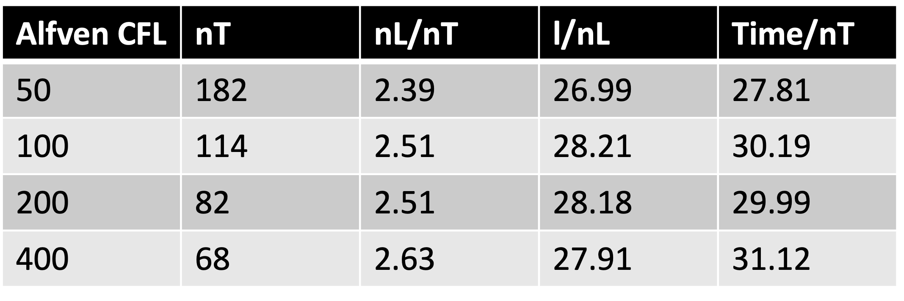
    

    

*The table presents the number of time steps (nT), the average number of nonlinear Newton steps per time step (nL/nT),
the average number of linear iterations per non-linear step (l,nL) and the average time per time step (t/nT) excluding IO.
These preliminary results indicates that the proposed PB/ABF method has excellent algorithmic and time per time step scaling
for increasing Alfven wave CFLs.*

----

## Highlight on multifluid EM plasma simulations for disruption mitigation techniques (preliminary results)
Michael Crockatt(SNL), John Shadid(SNL), Roger Pawlowski(SNL), Sidafa Conde (SNL), Tom Smith (SNL), Sibu Mabuza (Clemson) 

For the TDS effort Sandia is extending and evaluating a multifluid electromagnetic (EM) plasma model
for simulating collisional partially ionized plasma systems with hydrodynamic and EM interactions that
can be strongly driven and create discontinuities and strong gradients. The model is based on a five
moment multifluid model. A specific capability goal is a flexible and extensible capability for modeling
complex multiphysics plasmas in the context of proposed tokamak disruption mitigation strategies.
The most general multifluid electromagnetic plasma model considered in this project is presented below.
This system has a hyperbolic transport/wave physics system sub-structure (Euler-Maxwell) with
strong EM, collisional, and ionization/recombination source term coupling, along with the inclusion of
2nd order diffusion type operators (most notably heat transfer). To make this ambitious approach to
employing scalable multifluid EM plasma models tractable for TDS, we are building on recent unique
algorithmic, and plasma-model developments by our team in the Drekar R&D MHD and multi-fluid/EM
code as a software-base. The overall structure of this model is given below.

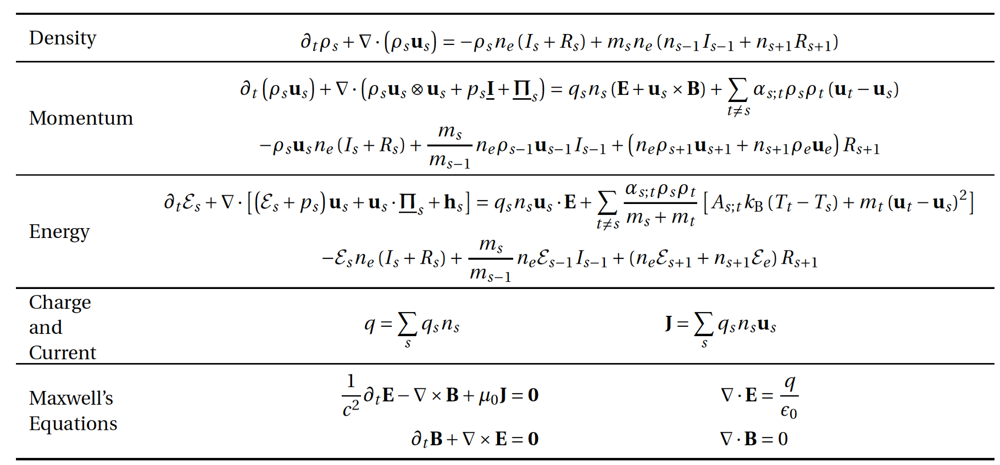
*Five moment general multifluid model for atomic species s with collisional, ionization and recombination
terms included and coupled to a full electromagnetic Maxwell system. This model is implemented within the
**Drekar** multiphysics code. **Drekar** is an implicit/explicit (IMEX) scalable parallel unstructured FE code
that employs algebraic flux corrected stabilization methods for handling unresolved gradients and strong shock discontinuities. 

----

## An illustration of a Two-dimensional diocotron instability – Analytic growth rate comparison
Michael Crockatt(SNL), John Shadid(SNL)

Diocotron instabilities [@ronald2001][@knauer1966][@petri2007], which are driven by velocity shear in non-neutral electron columns, have been
studied experimentally and computationally in beam and cylindrical geometries. We
consider a configuration consisting of a cylindrical electron beam inside a uniform axial magnetic field. In
this case, a rotational velocity is produced in the plasma column due to $E\times B$ forces exerted on the electron
fluid. A suficiently strong shear in this rotational velocity drives the development of the cylindrical diocotron
instability. Because the development of the instability is dominated by $E\times B$ forces, the electric drift
approximation is often used to reduce the electron velocity equation to that of a guiding center model, which
removes the cyclotron motion of the particles.

<video controls preload="metadata" width="100%">
    <source src="../img/gallery/drekar/diocotron-instability-2d_5_1e-3_elliptic-potential_000512_presentation.mp4" type="video/mp4">
    Sorry, your browser doesn't support embedded videos.
</video>
*The movie shows the computed solution on a triagnular FE mesh for the case for the linear growth and saturation of the
Instability. The two figures show the computed growth of the most unstable mode for both a full multifluid comptuation
And a generalized Ohm’s law formulation in Drekar.*

    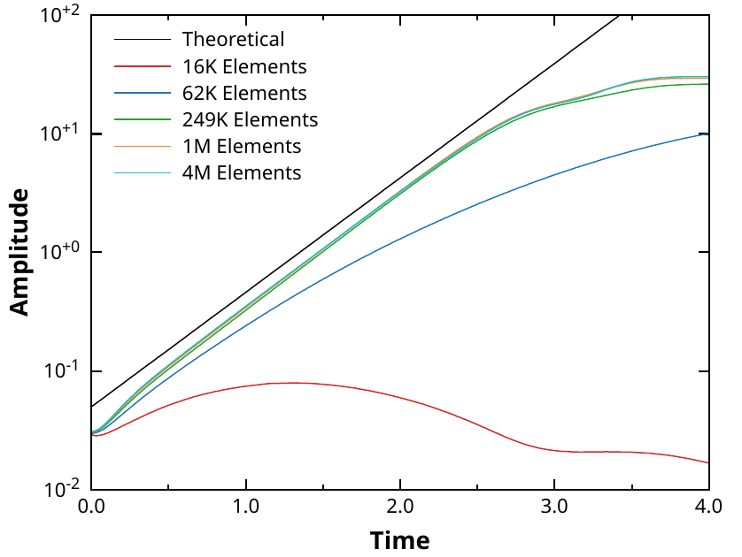
    <em>Multifluid growth rate vs mesh resolution</em>

    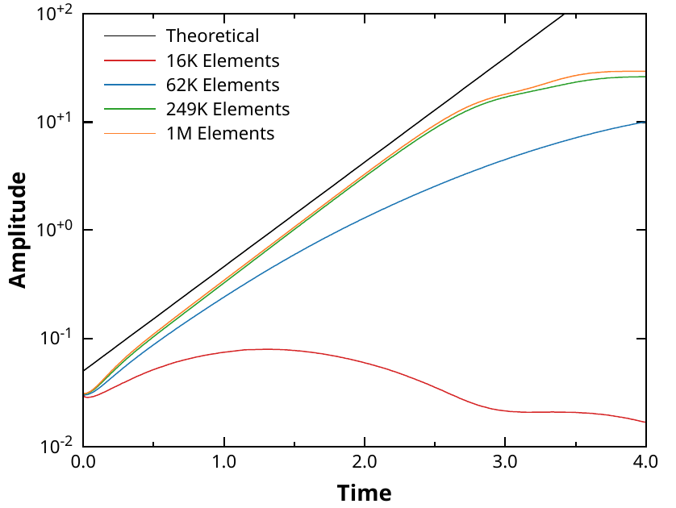
    <em>Generalized Ohm's law without electron inertia</em>

----

## Scalable multilfuid EM solvers based on multiphysics block preconditioning
John Shadid (SNL), Edward Phillips (SNL)

A critical component of simulating large-scale multifluid systems is our
physics-based (PB) / approximate block preconditioning (ABF) preconditioning approaches for complex
multiphysics, these methods reduce the implicit solve for the complex coupled multifluid system into
a set of sub-systems that segregate the physics (in the preconditioner only) for which we have demonstrated
the use of scalable algebraic multilevel solvers. As a demonstration of the scalability of our multifluid
simulation capabilities we present an example weak scaling study. This example is for a fully-ionized
ion/electron high density/pressure core expanding into a magnetized background ion/electron
plasma and the simulations were run on the LANL Trinity machine on > 16,000 cores.

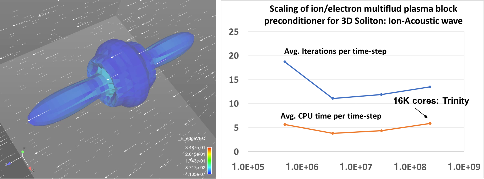
*Illustration of weak scaling for implicit fully-ionized multifluid plasma model (electrons, ions) for the simulation of an 3D high density/pressure
cloud expanding in a lower density background plasma with anisotropic expansion due to the presence of a magnetic field. Multiphysics block preconditioning
methods are used to provide a scalable solution in parallel on the Los Alamos Trinity machine.*

The physics simulation goal is to understand impurity penetration and assimilation into plasmas for proposed disruption
mitigation techniques. These techniques currently include massive gas injection and frozen pellet injection.
To computationally simulate the proposed type of problems requires robust, accurate and
scalable plasma modeling capabilities. We have completed an initial development of a general
capability for partially-ionized plasmas composed of multiple atomic species with strongly driven multidimensional
hydrodynamic transport processes, collisional, ionization and recombination interactions,
and strong coupling to electric and magnetic fields.

### Neutral cloud expansion in a core region
Here we first present an idealization of the process of introducing a
high-density neutral species into the core region of a Deuterium plasma at conditions that are representative of
Tokamak devices. In this case a 1D simulation is present and the transport is taken to be parallel to the magnetic field direction.

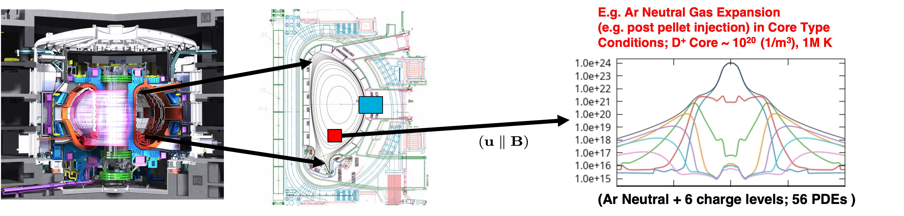
*Schematic diagram of an idealized insertion of a neutral cloud in the core region for disruption mitigation. Inside the separatrix a
high density neutral cloud of Ar ionizes as it expands into a hot (10keV) Deuterium plasma environment.*

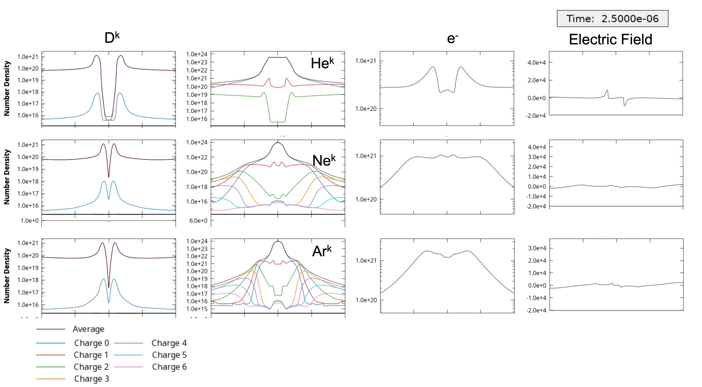
*Comparison of expansion of (He, Ne, Ar) neutral cloud in the core region for disruption mitigation at 2.5 micro-seconds. Inside the separatrix the
high density neutral cloud ionizes as it expands into a hot (10keV) Deuterium plasma environment. The simulation tracks up to 10 species Deuterium neutral and ion, electrons
and the neutral and up to 6 charge states of the inserted species.*

### Massive gas injection
Next, we present an idealization of the process of injecting a high-density neutral species from the Tokamak wall into the core region.
The jet first expands in the fill tube region, the propagates through a low-density edge/vacuum region, then impacts a static Deuterium plasma core at conditions that are
representative of Tokamak devices. In this case a 1D simulation is present and the transport is taken to be perpendicular to the magnetic field direction.

*Schematic diagram of an idealized massive gas injection of a He neutral into the core region for disruption mitigation. The
jet expands through the edge/vacuum region and impacts a static Deuterium core.*

<video controls preload="metadata" width="100%">
    <source src="../img/gallery/drekar/He_3e21_neutral_D_plasma_highorder_ndlimiter_1e15_cfl_20_2.mp4" type="video/mp4">
    Sorry, your browser doesn't support embedded videos.
</video>
*Illustration of a 2D jet of high-density neutral Helium injected from a reservoir at n = $3\cdot 10^{21}\, m^{-3}$ expanding into the edge/vacuum region and impacting a static Deuterium plasma core.
Here a strong breaking assumption is used on the charge species due to an imposed strong static magnetic field perpendicular to the jet injection direction.
The simulation time is 5 ms and plots the linear (upper left) and logarithmic (lower left) mass density for all the species [kg/m^3],
the electron temperature [K] (lower right), and the electron mass density [kg/m^3] (upper right). The problem set up is similar to E. Nardon et. al. (2017
Nucl. Fusion 57 016027) for the injection of D2.*

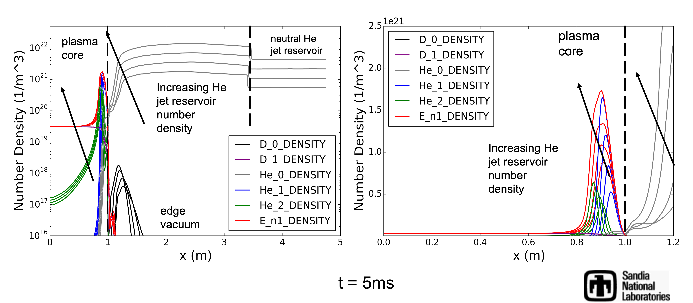
*Summary of preliminary results for He neutral jet injection from Tokamak wall at 5ms. The results are for increasing levels of
He jet number density, 3.0e+21, 6.0e+21, 1.2e+22, 2.4e+22 [1/m^3]. These levels correspond to
~100x, 200x, 400x, 800x the initial D+ nuclei content of the core plasma. Here the number density [1/m^3] is plotted. The problem set up is similar to E. Nardon et. al. (2017
Nucl. Fusion 57 016027) for the injection of D2. Left full domain, right close-up of core region.*

\bibliography

