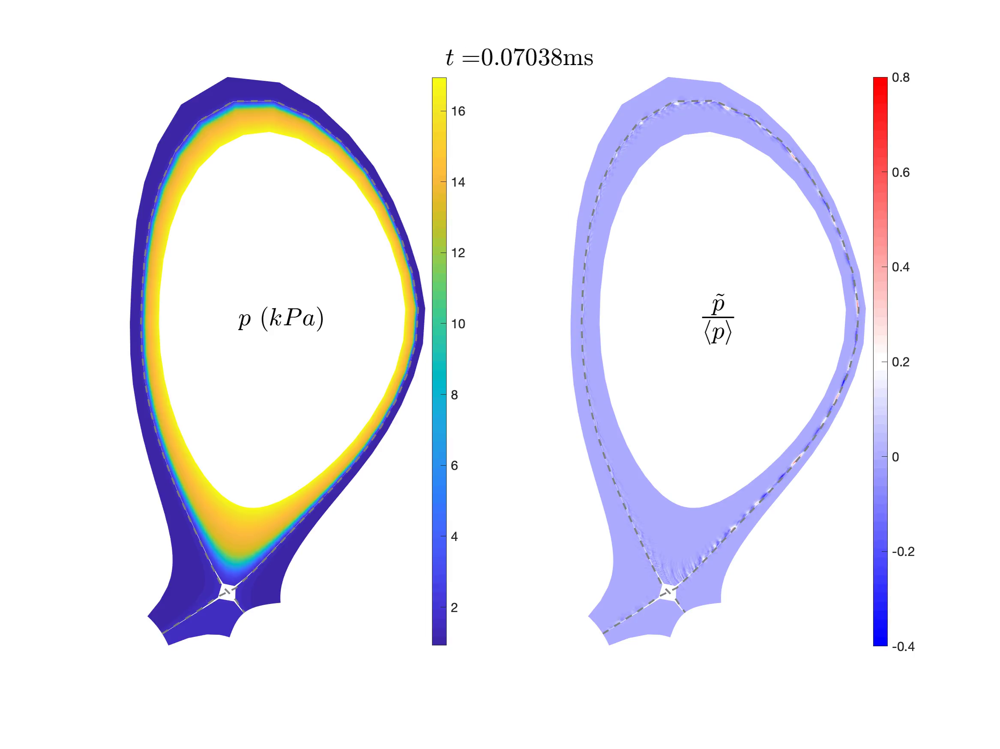
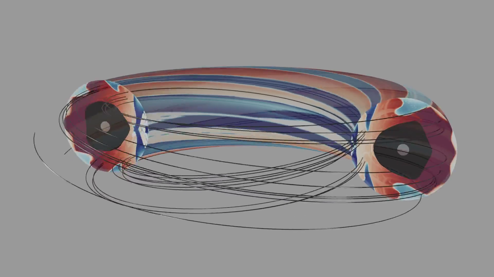
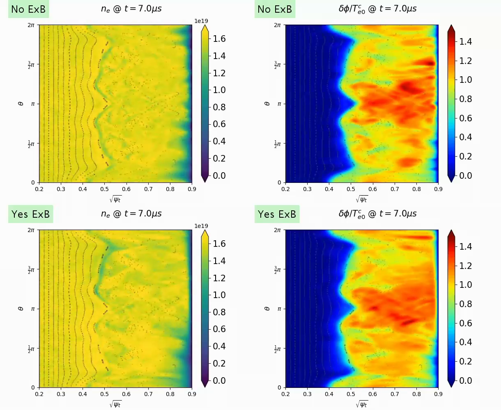
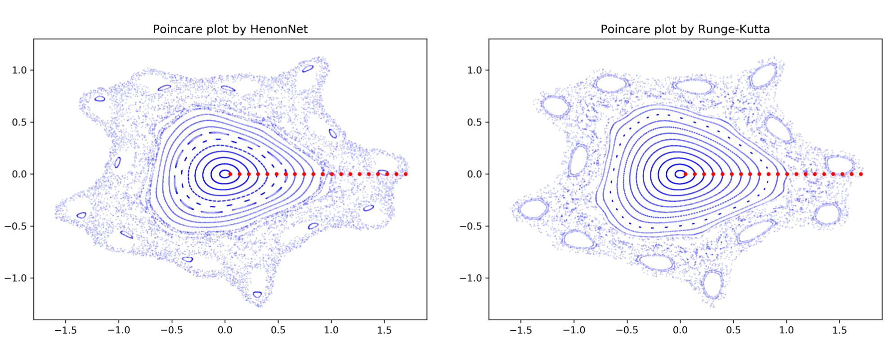
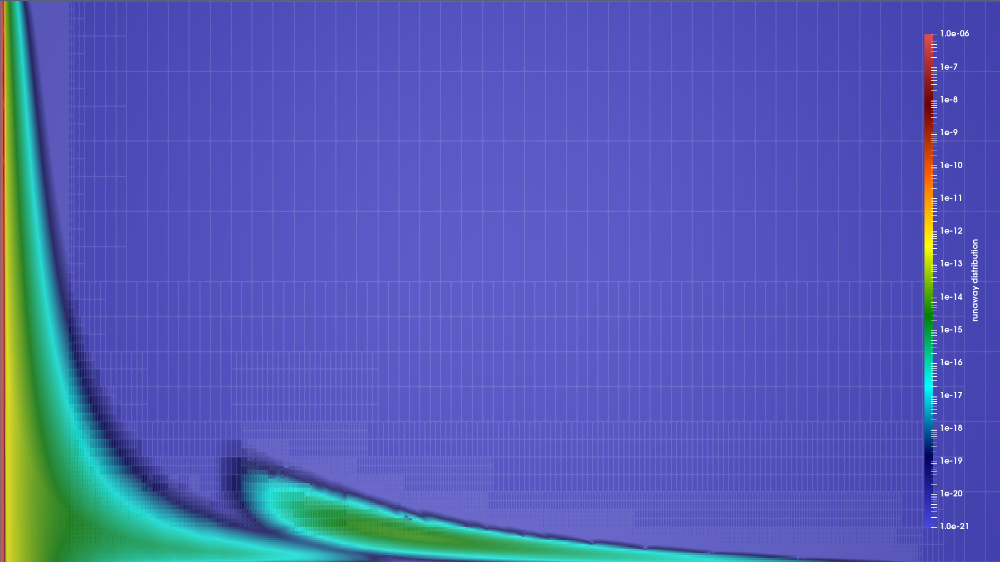
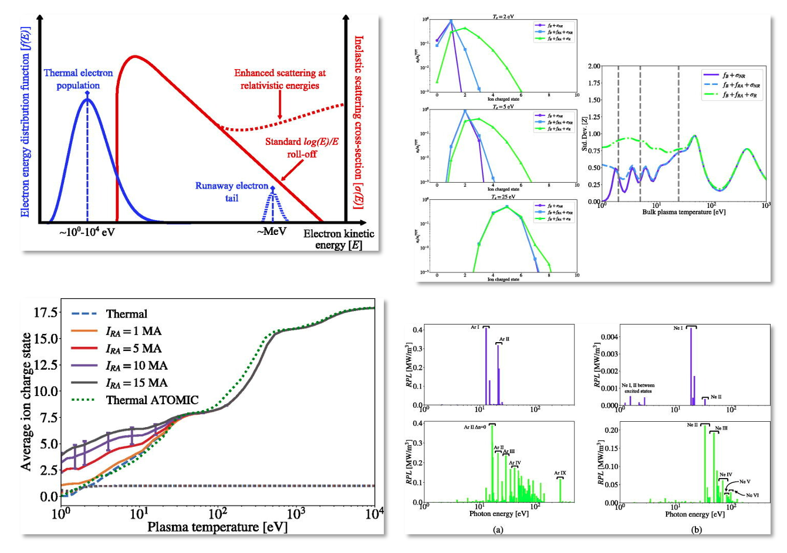
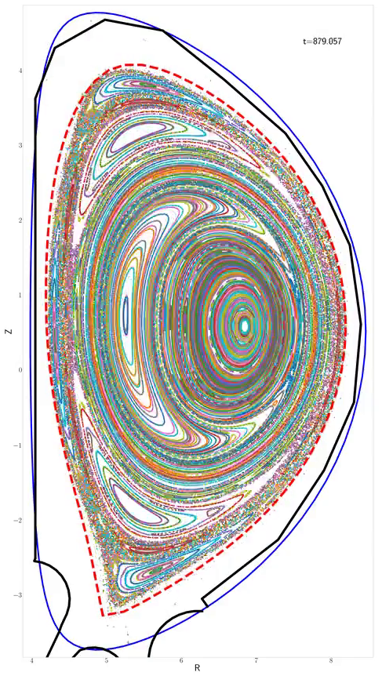
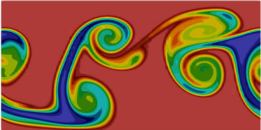
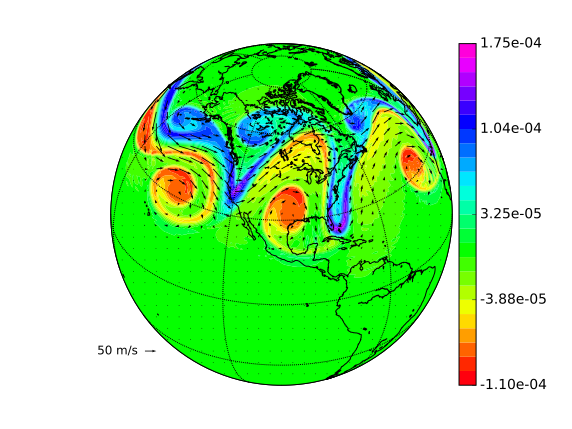

# Gallery

This page collects results from various simulations from the TDS team. Most pictures are linked to simulation movies.

 

*Pressure perturbation increases ~5x and spreads from near separatrix to the entire domain. (left) the total pressure; (right) normalized pressure.*

----

*TQ simulations with and w/o mitigation (MGI). MGI stands for Massive Gas Injection. Simulations suggest that MGI could reduce the peak heat load on divertor target and spreads it over a wider wetting area.*

----

*The 3D structure of the effective magnetic mirror ratio $M_{eff}$ in the presence of open stochastic magnetic fields. The black line shows an example open magnetic field line. Red and blue colors represent regions of magnetic wells ($M_{eff} > 1$) and magnetic hills ($M_{eff} < 1$), respectively. Charged particles can be trapped in the magnetic well region by the magnetic mirror force.*

----

*The temporal evolution of (left) electron density and (right) electrostatic potential in the presence of open stochastic magnetic fields during the thermal quench. Upper figures show the case where the $\mathbf{E}\times\mathbf{B}$ drift motion is ignored, whereas lower figures show the case where the ExB drift motion is included.*

----

*Replace "direct solution" of algebraic system with surrogate approximation using sparse grid collocation (interpolation) in
a free-boundary Grad-Shafranov solver.*

----

*The Poincare plot can be generated using HenonNets 10x faster than conventional methods while achieving comparable accuracy.*

----

*2D island coalescence using a very high-order HDG scheme. The current sheet breaks into plasmoids.*

----

*3D island coalescence using a very high-order HDG scheme. A current sheet is forming in the center of the domain.*

----

*hp-adaptive HDG solver*

*PETSc-p4est-based relativistic Fokker-Planck solver can capture features in distribution functions dynamically.*

----

*MFEM-based MHD solver resolves multi-scale features involving a thin current sheet and plasmoid instability.*

----

*Unstructured FE hex mesh of ITER plasma domain and solid wall using Cubit. Cubit provides both all hexahedron and tetrahedron capabilities. Capabilities for automatic uniform refinement and parallel portioning are available. As well soon a uniform refinement that snaps the element edges to the geometry will also be available.*

----

<video controls preload="metadata" width="100%">
    <source src="../img/gallery/drekar/VDE_movie.mp4" type="video/mp4">
    Sorry, your browser doesn't support embedded videos.
</video>
*An initial VDE simulation on 3D ITER geometry usign a VMS compressible resistive MHD formulation in Drekar.*

----

*Schematic diagram of an idealized insertion of a neutral cloud in the core region for disruption mitigation. Inside the separatrix a
high density neutral cloud of Ar ionizes as it expands into a hot (10keV) Deuterium plasma environment.*

----

*Particle simulation of two-stream instability with three different weight schemes: (left) full-f, (middle) generalized delta-f, and (right) typical delta-f. Upper and lower figures show the motion of electron markers and the evolution of the total electron distribution function in the phase-space ($x-v$), respectively. Whereas the typical delta-f scheme (right) fails after a short time, the newly developed generalized delta-f scheme (middle) successfully simulates the same result as the full-f (left) does.*

----

*3D Kelvin-Helmholtz instability of MHD*

----

*Collisional-radiative modeling related to runaway electrons*

----

*A full reconnection event induced by a (1,1) kink instability of a Bennet pinch equilibrium in helical geometry with $\chi_\parallel/\chi_\perp \sim 10^{7}$.*

----

*Magnetic topology in excerpt of (1,1) kink simulation without thermal diffusion. As the (1,1) mode grows the core splits and gets expelled while magnetic stochasticity has set in at the outer edge. Towards the end, isolated islands reform but nothing remains from the original core.*

----

*Magnetic topology in excerpt of (1,1) kink simulation with thermal diffusion. The mode grows and splits the core. Magnetic stochasticity sets in outside the core.  The core eventually reheals forming a transport barrier.*

----

*Magnetic topology in excerpt of the double tearing simulation. Lots of different islands form due to multiple double tearing surfaces of higher order. The edge develops stochasticity while the core and some isolated islands survive.*

----

*3D Kelvin-Helmholtz instability for Euler equations. An exponential time integrator is used along with a high-order DG scheme.*

----

*3D Kelvin-Helmholtz instability for shallow water equations on a sphere. A IMEX integrator is used along with a high-order HDG-DG scheme.*

