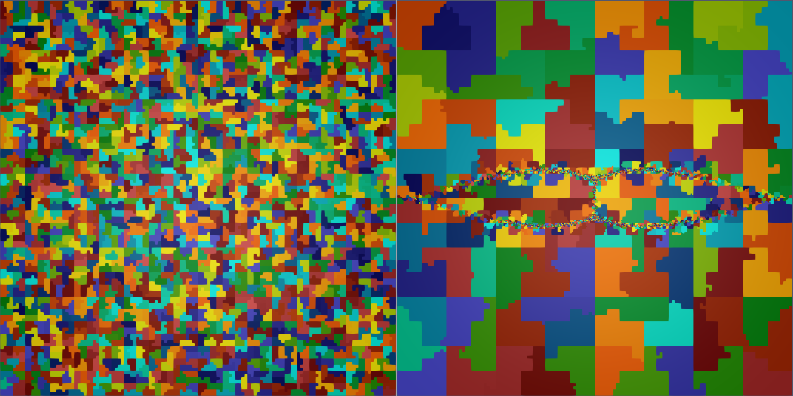

# Scalable MFEM-based resistive MHD solver
Qi Tang (LANL), Luis Chacon (LANL), John Shadid (SNL), Tzanio Kolev (LLNL), Xianzhu Tang (LANL)

**LA-UR-22-22440. Approved for public release; distribution is unlimited.** 

## Overview

The magnetohydrodynamics (MHD) equations are continuum models used in the study of a wide range of plasma physics systems, including the evolution of complex plasma dynamics in tokamak disruptions. However, efficient numerical solution methods for MHD are extremely challenging due to disparate time and length scales, strong hyperbolic phenomena, and nonlinearity. Therefore the development of scalable, implicit MHD algorithms and high-resolution adaptive mesh refinement strategies is of considerable importance. 

We recently developed a high-order stabilized finite-element algorithm[^1] for the reduced visco-resistive MHD equations based on [MFEM](https://mfem.org). The scheme is fully implicit, solved with the Jacobian-free Newton-Krylov (JFNK) method with a physics-based preconditioning strategy. Our preconditioning strategy is a generalization of the physics-based preconditioning methods in [Chacon, et al, JCP 2002] to adaptive, stabilized finite elements. Algebraic multigrid methods are used to invert sub-block operators to achieve scalability. A parallel adaptive mesh refinement scheme with dynamic load-balancing is implemented to efficiently resolve the multi-scale spatial features of the system. The potential of the AMR approach is observed in an island coalescence problem in the high Lundquist-number regime ($\ge 10^7$) with the successful resolution of plasmoid instabilities and thin current sheets.

----

## Result

<video controls preload="metadata" width="100%">
    <source src="../img/gallery/res1e-6.mp4" type="video/mp4">
    Sorry, your browser doesn't support embedded videos.
</video>
*This simulation uses 6 levels of AMR refinement, H1 finite elements of 3rd order polynomials, physics-based preconditioning, and stabilized discretization on 1800 CPUs. The run is initialized with two magnetic islands and they collide into each other and form the current sheet. The movie zooms in the center of the entire simulation domain. Here it uses the Lundquist number of $10^6$. Therefore, the plasmoids start to appear around the thin current sheet at a later time, and those plasmoids are quickly ejected into the jet region in the top and bottom of the current sheet.*

----

<video controls preload="metadata" width="100%">
    <source src="../img/gallery/res1e-6-2.mp4" type="video/mp4">
    Sorry, your browser doesn't support embedded videos.
</video>
*Zoomed-in view of the above run around the current sheet*

----

*Domain decomposition at the intial time (left) and the final time (right) of the above run. A random number is assigned to each domain for visualization. Since a space filling curve is used for partitioning, the decompositions are mostly continuous througout the run.*

----

<video controls preload="metadata" width="100%">
    <source src="../img/gallery/res1e-7.mp4" type="video/mp4">
    Sorry, your browser doesn't support embedded videos.
</video>
*This simulation uses 7 levels of AMR refinement and the Lundquist number of $10^7$ instead. The run is also initialized with two magnetic islands and a very thin current sheet is forming in the center. Note that many plasmoids continuously appear around the current sheet particularly near the center of the domain (x point), and those plasmoids collide into each other and form a very complicated structure.*

[^1]: Q. Tang, L. Chacon, T. V. Kolev, J. N. Shadid and X.-Z. Tang. [An adaptive scalable fully implicit algorithm based on stabilized finite element for reduced visco-resistive MHD](https://doi.org/10.1016/j.jcp.2022.110967), *J. Comput. Phys.*, 454:110967, **2022**.

