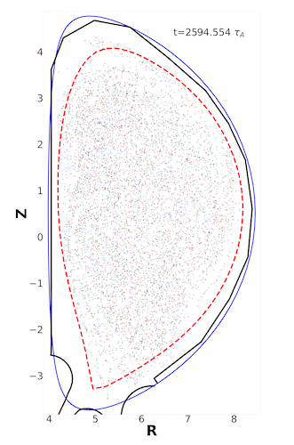
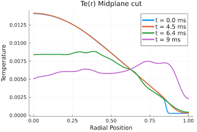

# Aligning Thermal & Current Quenches with a High-density Low-Z Injection
Jason Hamilton (LANL), Luis Chacón (LANL), and Xianzhu Tang (LANL)

**LA-UR-23-26454. Approved for public release; distribution is unlimited.** 

## Overview

When Rosenbluth and Putvinskii suggested high-density deuterium injection, the aim was to suppress the avalanche instability, since the Connor-Hastie threshold electric field $E_c$ scales linearly with the free electron density $n_e$. Recently we have found an additional benefit of this approach in its ability to overcome the Thermal Quench (TQ) mitigation challenge. The underlying physics is that by massively boosting the plasma density with deuterium, the ionization energy loss is modest even for a 100 times increase in deuterium density, compared with each electron's kinetic energy, which starts at 15 - 25 KeV in a burning plasma, so the plasma pressure after the massive hydrogen injection is comparable to the pre-injection condition. The would-be disruption-inducing MHD instabilities will proceed as usual, likely even further aggravated by the higher density and lower temperature plasma. However, the collisionality of the plasma has now increased by many orders of magnitude, as the result, parallel transport in such a post-injection plasma is in the Braginksii collisional regime. This transition to collisional parallel transport drastically slows down the thermal quench[^1] and raises the prospect of aligning the thermal quench with the current quench in time duration.

## Results
In Fig 1., we show the temperature profile evolution, along with a Poincare section showing the field line stochasticity, in a nonlinear MHD simulation that actually implements the Braginskii parallel thermal conduction in an ITER plasma where the deuterium density has been boosted 300 times as the result of deuterium injection and assimilation. The plasma beta has been kept unchanged by also decreasing the initial temperature profile by the same factor of 300, such that the initial peak temperature is around 65 eV. The MHD simulation deploys a sheath boundary condition with a Bohm speed and sheath energy transmission coefficients from kinetic simulations [^2] [^3] [^4]. In an ongoing study, we will carry out such simulations in WDM modelling codes that account for the feedback from a conducting boundary with finite wall time.

 
*Fig 1. PIXIE3D simulation of a mitigated ITER disruption with massive deuterium injection (300 times increase in density). TQ slows down to CQ time scale even with a fully stochastic B field.*

## Ongoing work

The key problems we aim to resolve are 

1. how much, if any, high-Z impurities can be introduced, and at which time, to shorten the TQ/CQ time duration to be consistent with a 150 ms time duration constraint and runaway suppression/minimization; 
1. how long the global field line stochasticity can be maintained during the TQ/CQ such that the runaways are subject to fast loss due to parallel streaming along the open field lines; 
1. whether wall-touching low (n,m) MHD instabilities can be avoided in such a plasma, even when the CQ duration becomes significantly longer than 150 ms. 

An ideal situation one can hope for would be the intriguing possibility that the Ohmic heating associated with the CQ can sustain a finite beta plasma that keep flux surfaces open for the majority of the CQ, so even if a runaway avalanche is triggered, runaway current is still controlled to a low value and/or decay much faster.

----

<video controls preload="metadata" width="100%">
    <source src="../img/pixie3d/Temp_2D_car.mp4" type="video/mp4">
    Sorry, your browser doesn't support embedded videos.
</video>
*Temperature color map during a (1, 1) kink instability. Thermal energy is lost to the sheath boundary condition if the grazing angle of the magnetic field exceeds a critical value.*

----

<video controls preload="metadata" width="100%">
    <source src="../img/pixie3d/Den_2D_car.mp4" type="video/mp4">
    Sorry, your browser doesn't support embedded videos.
</video>
*Density color map during the same Pixie3D simulation as shown in the previous video. Initial density is uniform, with the assumption that the injected deuterium has fully diffused throughout the vacuum region.*

----

<video controls preload="metadata" width="100%">
    <source src="../img/pixie3d/sheathnewalpha.mp4" type="video/mp4">
    Sorry, your browser doesn't support embedded videos.
</video>
*Poincare section animation during the same Pixie3D simulation shown in the previous two videos. With quick thermal loss to the sheath boundary, temperature gradients steepen in the interior region, driving a (1,1) kink instability. After the instability saturates, all flux surfaces are broken and the magnetic topology is now stochastic. Periodically, small surfaces re-appear briefly before disappearing.*

----

[^1]: Jun Li, Yanzeng Zhang, and Xian-Zhu Tang. Staged cooling of a fusion-grade plasma in a tokamak thermal quench. Nuclear Fusion, 63(6):066030, May 2023.

[^2]: Yuzhi Li, Bhuvana Srinivasan, Yanzeng Zhang, and Xian-Zhu Tang. Bohm criterion of plasma sheaths away from asymptotic limits. Phys. Rev. Lett., 128:085002, Feb 2022.

[^3]: Xian-Zhu Tang and Zehua Guo. Sheath energy transmission in a collisional plasma with collisionless sheath. Physics of Plasmas, 22(10), 2015.

[^4]: Xian-Zhu Tang and Zehua Guo. Kinetic model for the collisionless sheath of a collisional plasma. Physics of Plasmas, 23(8), 2016.

