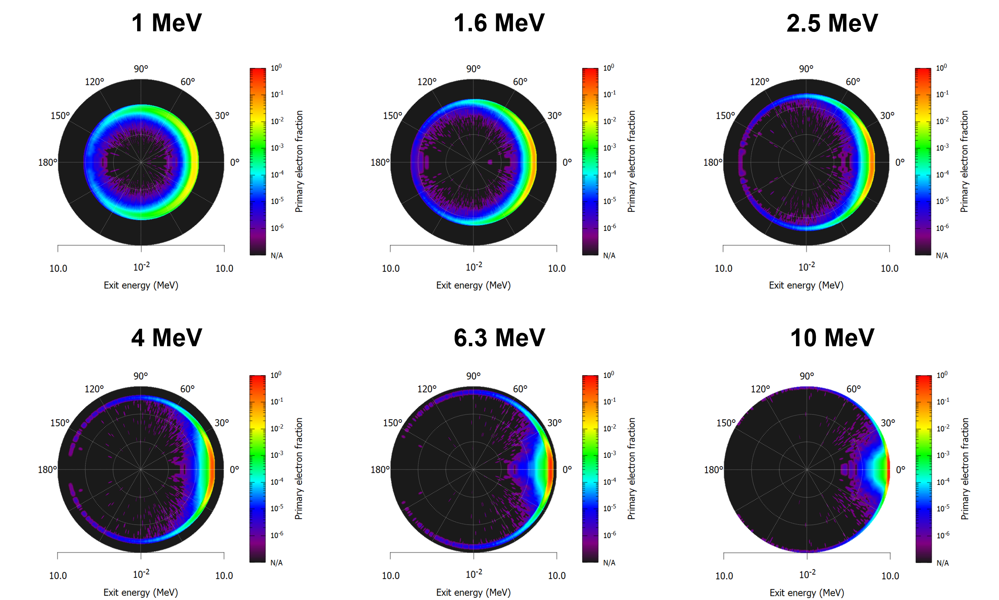
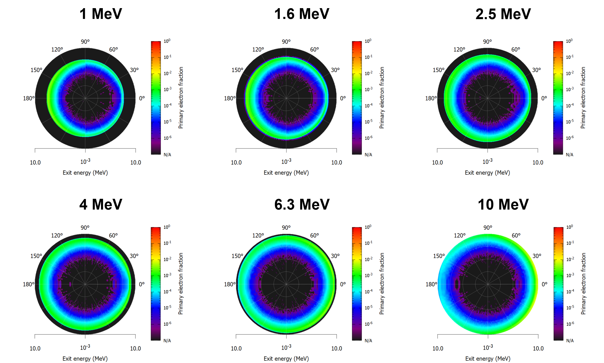
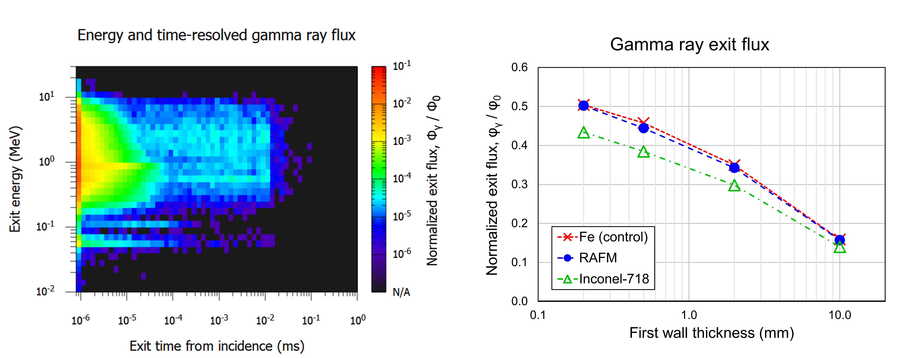

# Plasma-Material Interactions for Disruption Mitigation Systems

Michael A. Lively (LANL), Danny Perez (LANL), Blas Uberuaga (LANL), and Xianzhu Tang (LANL)

**LA-UR-23-26059. Approved for public release; distribution is unlimited.**

## Overview

The reactor environment during a tokamak disruption poses unique challenges from the plasma-material interactions perspective. Problems of interest include: ablation of pellet fragments from shattered pellet injection (SPI) by hot plasmas during the thermal quench (TQ); attenuation and scattering of relativistic electrons by pellet fragments during the current quench (CQ); plasma-surface contact at the first wall and divertor during the TQ; runaway electron beam impact at the wall during the CQ; and runaway electron seeding from Compton scattering by gamma rays from the activated walls.

To study these problems, we leverage a diverse simulations toolkit, including:

* The [Monte Carlo N-Particle \(MCNP\)](https://mcnp.lanl.gov/) code to simulate transport of neutrons, photons, and electrons in materials.
* Molecular dynamics simulations of ion-surface interactions using the [LAMMPS](https://www.lammps.org) program.
* The [PETSc](https://petsc.org) solver to model pellet ablation and vaporization via constructing a heat equation.

----

## Highlight: Relativistic Electron Scattering and Attenuation by Shattered Pellet Injection

We consider shattered pellet fragments as macrobodies, and aim to develop the collision operator, $C_{frag}(f)$, which solves a Fokker-Planck equation for runaway electrons,
\begin{align}
    \frac{df}{dt} = \frac{\partial f}{\partial t} + \textbf{v}\cdot\nabla f - \frac{e}{m}\left(\textbf{E} + \frac{\textbf{v}\times\textbf{B}}{c}\right)\cdot\nabla_{\textbf{v}}f = C_{frag}(f)
\end{align}
To accomplish this, we use MCNP to simulate the interaction between incident relativistic electrons (0.5 to 25 MeV) and a shattered pellet fragment. We obtain the anergy and angle-resolved distribution of relativistic electrons escaping the fragment and the deposition of energy and particles into the fragment itself. Interacting electrons may lose sufficient energy or scatter through a large enough angle to no longer be part of the overall runaway electron beam.

*Energy and angle-resolved fluxes of primary electrons exiting from a cylindrical Ne pellet fragment with $L=D=1$ mm, obtained from MCNP simulations.*

In addition to shattered pellets, we also assess the efficacy of W pellets or balls as a last-resort runaway termination method. In addition to the much stronger attenuation and backscattering effect from W compared to Ne, a significant fraction of incident electrons are absorbed into the pellet, ranging from ~10% at 10 MeV to ~50% at 1 MeV.

*Energy and angle-resolved fluxes of primary electrons exiting from a cylindrical W pellet fragment with $L=D=1$ mm, obtained from MCNP simulations.*

## Highlight: Runaway Electron Seeding by Gamma Ray Flux from Activated Walls

During fusion operations, the first wall and structural materials of a tokamak are activated by the flux of 14-MeV fusion neutrons from the plasma. The gamma ray flux out of the wall from neutron capture reactions may reenter the plasma and Compton scatter plasma electrons to relativistic energies, generating a runaway electron seed. We perform MCNP simulations to evaluate the gamma ray flux out of the wall and its dependence on system parameters such as structural material type and first wall thickness. Our results can inform materials design of present and future tokamak devices.

*Left: Energy and time-resolved gamma ray flux from a RAFM steel structural block with a 2 mm-thick W first wall simulated by MCNP. Right: Total gamma ray flux from the wall simulated by MCNP as a function of W first wall thickness and structural block material.*

